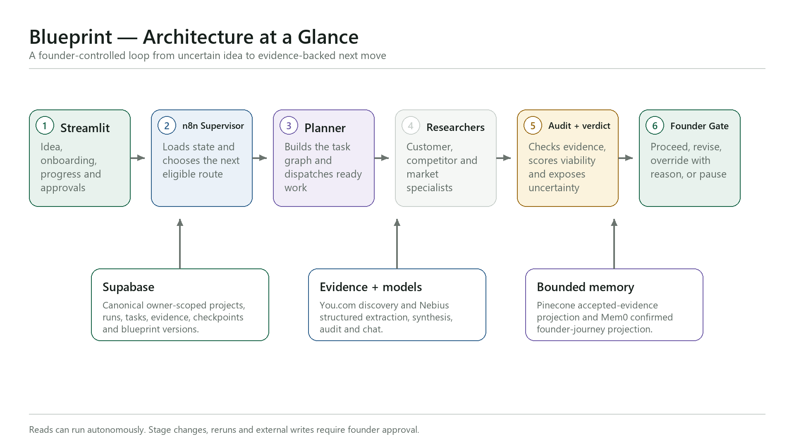

# Blueprint

Blueprint is an evidence-first multi-agent decision system that turns an unfinished founder idea into a sourced research verdict and the next provable move.

> Blueprint helps an early-stage founder turn an unfinished product idea into an evidence-backed proceed, revise or pause decision in a web app. It autonomously plans and runs scoped customer, competitor and market research, but consequential writes, reruns and stage progression remain under human approval.

## What problem it solves

Early-stage founders usually research ideas across search tabs, notes, spreadsheets and disconnected AI chats. The result is often a polished report with unclear evidence, invented precision and no reliable decision path.

Blueprint instead connects four things:

1. Founder context: idea, goal, audience, geography, budget, time and prior work.
2. Evidence: customer/user signals, direct and indirect competitors, and secondary market research with source lineage.
3. Decision policy: evidence audit, deterministic scoring and explicit uncertainty.
4. Founder control: a human checkpoint before the system changes the Blueprint or advances a stage.

## Architecture at a glance



The complete project canvas plus the high-resolution PNG and editable SVG pack live in [`docs/figures/architecture`](docs/figures/architecture). Use [`docs/ARCHITECTURE-FIGURES.md`](docs/ARCHITECTURE-FIGURES.md) as the visual index.

## Founder journey

1. Open the Streamlit landing page; Blueprint silently creates an owner-isolated Supabase anonymous session.
2. Describe the idea and complete onboarding for goal, audience, geography, budget, time and prior progress.
3. Blueprint creates Foundation immediately from confirmed founder inputs.
4. The adaptive planner builds the eligible task graph and runs Customer/User, Competitor and Market specialists in parallel.
5. The Evidence Auditor accepts, limits or rejects claims and preserves contradictions.
6. The deterministic Viability Engine scores demand, differentiation and market access while keeping evidence sufficiency separate.
7. Blueprint publishes a versioned Research Blueprint with findings, sources, risks, limitations and next actions.
8. The founder chooses proceed, override with a recorded reason, revise/pivot or pause.
9. Only the approved route can unlock Stage 2 Prove & Design and the advisory Stage 3 Action Blueprint.

Completed sections remain readable while sibling research continues. A failed specialist does not erase successful work.

## Architecture

```text
Streamlit founder workspace
        │ authenticated, idempotent request
        ▼
n8n API boundary → Adaptive Supervisor
        │
        ├── Dynamic Planner → Eligible Scheduler
        │       ├── Foundation builder
        │       ├── Customer/User Research specialist ┐
        │       ├── Competitor Research specialist    ├─ parallel
        │       └── Market Research specialist        ┘
        │
        ├── Evidence Auditor → Viability Engine
        ├── Blueprint Synthesizer → Independent Quality Critic
        └── Founder checkpoint → approved continuation or safe stop

Supabase = canonical state and ownership
You.com = bounded web discovery
Nebius = structured specialist, synthesis, audit and chat roles
Pinecone = rebuildable accepted-evidence projection
Mem0 = confirmed founder-journey projection
```

Detailed diagrams:

- [End-to-end system architecture](docs/figures/architecture/02-end-to-end-system-architecture.png)
- [Founder user journey](docs/figures/architecture/03-founder-user-journey.png)
- [Adaptive orchestration and routing](docs/figures/architecture/04-adaptive-orchestration-routing.png)
- [Stage 1 parallel research](docs/figures/architecture/05-stage1-parallel-research.png)
- [Agent handoffs and shared state](docs/figures/architecture/06-agent-handoffs-shared-state.png)
- [Evidence grounding and RAG](docs/figures/architecture/07-evidence-grounding-rag.png)
- [State and memory model](docs/figures/architecture/08-state-and-memory-model.png)
- [Failure, HITL and recovery](docs/figures/architecture/09-failure-hitl-recovery.png)
- [Evaluation and observability](docs/figures/architecture/10-evaluation-observability.png)
- [Deployment boundary](docs/figures/architecture/11-deployment-boundary.png)

## Agent and workflow roles

| Role | Job | Boundary |
|---|---|---|
| API boundary | Verify owner, input contract and idempotency before starting or resuming a run. | Reject malformed and cross-owner requests before agent execution. |
| Adaptive Supervisor | Load durable state, choose the next eligible route and re-evaluate after every observation. | Cannot bypass stage locks, task budgets or human gates. |
| Dynamic Planner | Create a goal- and evidence-specific directed acyclic task graph. | Produces only allowlisted modules and tools. |
| Eligible Scheduler | Atomically claim ready work, dispatch workers and unlock dependants. | Preserves completed siblings and prevents duplicate claims. |
| Research specialists | Produce structured Customer/User, Competitor and Market findings. | Claims must reference supplied evidence IDs or be labelled assumptions. |
| Evidence Auditor | Check citation allowlists, relevance, freshness, conflicts and coverage. | Rejected evidence cannot affect the verdict. |
| Viability Engine | Compute the 40/30/30 demand, differentiation and access score. | Deterministic policy; evidence sufficiency is reported separately. |
| Blueprint Synthesizer | Create an immutable Research or Action Blueprint version. | Cannot publish past the relevant founder checkpoint. |
| Quality Critic | Score completeness, grounding, contradictions, actionability and safety. | One bounded revision; cannot approve unsupported claims. |
| Research Copilot | Answer from the selected section and accepted owner-scoped context. | Explains and proposes; reruns require preview and approval. |
| Failure Router | Choose retry, repair, reload, partial, human review or safe fail. | Attempt and cycle budgets prevent infinite loops. |

Importable workflow JSON is stored in [`backend/n8n`](backend/n8n).

## State and memory

Blueprint uses multiple memory layers because they have different authority and failure behavior:

| Memory | Store | Lifetime | Authority |
|---|---|---|---|
| Working UI state | Streamlit session | Browser session | Ephemeral cache only |
| Episodic and exact workflow state | Supabase/PostgreSQL | Durable | Canonical system of record |
| Semantic accepted evidence | Pinecone | Rebuildable | Projection; every hit is revalidated |
| Confirmed founder journey | Mem0 | Cross-session | Personalization projection only |

Blueprint never stores raw chain of thought. It persists inputs, route reasons, selected tools/models, accepted sources, decisions, corrections and outcomes.

## RAG and grounding

Ask Blueprint is section-scoped and owner-scoped:

1. Route the question and deterministically reject unrelated actions, prompt-override attempts, hidden-prompt/secret requests, raw-trace requests, and cross-founder data requests before the model is called.
2. Retrieve the selected section, verdict, actions and accepted evidence from Supabase.
3. Optionally retrieve semantically related accepted evidence from Pinecone.
4. Revalidate every semantic hit against canonical Supabase records.
5. Generate a bounded answer with evidence labels, limitations and a suggested next move.
6. If the user requests a rerun, show an impact preview and require explicit approval.

Uploaded-document RAG and LlamaIndex ingestion are planned for V2; they are not represented as completed V1 functionality.

## Human-in-the-loop and safety

Reads are autonomous. These actions require explicit human approval:

- advancing Gate 1 or Gate 2;
- rerunning research or invalidating downstream modules;
- changing confirmed founder/profile truth;
- creating a new finalized Blueprint version;
- any external create, modify, send, publish, purchase, pay or delete action.

V1 does not send messages, contact leads, book meetings, pay for tools, publish content or delete records. Out-of-scope requests receive a clear refusal and a safe in-scope alternative.

Ask Blueprint may explain the public architecture and trust boundaries, but it never exposes system/developer prompts, hidden instructions, chain of thought, credentials, tokens, private configuration, raw internal traces, or another founder's data.

## Failure handling

Blueprint treats the unhappy path as a product state:

- transient provider errors retry with bounded backoff;
- malformed model output receives one schema repair;
- unsupported citations are rejected before scoring;
- contradictory evidence is preserved and lowers confidence;
- successful sibling research remains available when one task fails;
- stalled runs reload durable state and resume only eligible work;
- Pinecone or Mem0 failure degrades retrieval/personalization without corrupting project truth;
- exhausted budgets end in partial, needs-input, human-review or safe-fail state.

Every route records owner/project/run identity, task, attempt, reason, model/tool, latency, evidence outcome and terminal status without storing provider secrets.

## Technology

- Streamlit and Python
- n8n self-hosted in Docker
- Supabase Auth, PostgreSQL, RPCs and row-level security
- You.com Search API
- Nebius Token Factory
- Pinecone
- Mem0
- Pydantic contracts and deterministic policy/evaluation scripts

## Run locally

```powershell
python -m venv .venv
.\.venv\Scripts\Activate.ps1
pip install -r requirements.txt
Copy-Item .streamlit\secrets.toml.example .streamlit\secrets.toml
streamlit run app.py
```

Open `http://localhost:8501`.

Required Streamlit settings:

```toml
SUPABASE_URL = "https://your-project.supabase.co"
SUPABASE_PUBLISHABLE_KEY = "your-publishable-key"
N8N_START_WEBHOOK_URL = "http://localhost:5679/webhook/blueprint/start"
REQUEST_TIMEOUT_SECONDS = "35"
```

Keep You.com, Nebius, Pinecone, Mem0, Supabase secret/service-role and database credentials only in n8n credentials or server-side environment variables. Never commit them.

## Evaluation

```powershell
python -m unittest discover -s tests -p "test_*.py" -v
node backend/scripts/verify-deterministic-foundation.js
node backend/scripts/verify-phase6b-workflows.js
node backend/scripts/run-phase6-evals.js
```

Current acceptance evidence is **35/35 Python tests**, **11/11 Phase 6B workflow-structure checks**, and **85/85 agentic regression cases**. The repository contains **27 importable n8n workflows** and **22 Supabase migrations**, plus deterministic agentic fixtures, planner branch tests, resilience injection and browser closed-loop checks. Release success means end-to-end task completion, not one impressive model response.

## Current limitations

- Public Streamlit cannot call a localhost n8n webhook; production needs a stable public HTTPS n8n endpoint with persistent storage.
- Stage 1 has the strongest live acceptance evidence; founder-approved Stage 2/3 continuation still requires final end-to-end acceptance.
- Market research is desk/secondary research. Blueprint must not describe it as completed primary research or proven demand.
- Listed competitor prices are not proof of willingness to pay. Purchase, deposit, signup or comparable behavioral evidence is required.
- Pinecone and Mem0 are bounded sidecars; Supabase remains the only canonical state authority.
- Uploaded-document ingestion and LlamaIndex-based document RAG remain V2 scope.
- Blueprint advises launch, distribution and growth decisions; it does not execute a founder's business operations.

## Repository structure

```text
blueprint-v2/
├── app.py                       # Streamlit entry point
├── pages/                       # Onboarding, dashboard and supporting views
├── blueprint/                   # UI, state, schemas and backend adapter
├── backend/
│   ├── n8n/                     # Importable orchestration workflows
│   ├── supabase/                # Migrations, RPCs and RLS verification
│   ├── schemas/                 # Typed API and agent contracts
│   ├── evals/                   # Frozen evaluation fixtures/reports
│   ├── scripts/                 # Builders and verification scripts
│   └── docs/                    # Technical design and build evidence
├── docs/
│   ├── figures/architecture/    # All high-resolution PNG and SVG diagrams
│   ├── ARCHITECTURE-FIGURES.md  # Visual index
│   └── FINAL-DEMO-RUNBOOK.md    # Exact demo prompt, route and narration
├── scripts/                     # Diagram and data-generation utilities
├── tests/
└── requirements.txt
```

## Demo and submission material

- [Final demo runbook](docs/FINAL-DEMO-RUNBOOK.md)
- [Architecture figure index](docs/ARCHITECTURE-FIGURES.md)
- [Submission document — DOCX](docs/submission/Blueprint-Week-3-Submission.docx)
- [Submission document — PDF](docs/submission/Blueprint-Week-3-Submission.pdf)
- [Information architecture](docs/information-architecture.md)
- [Video transcript](docs/VIDEO-TRANSCRIPT.md)
- [Walkthrough guide](docs/LOOM-WALKTHROUGH.md)

## Deployment path

1. Host n8n behind stable public HTTPS with persistent workflow data and credentials.
2. Replace the local webhook URL in Streamlit Cloud secrets.
3. Deploy the GitHub `main` branch to Streamlit Community Cloud.
4. Run a fresh anonymous-user happy path, guarded failure path, stalled-run resume and second-user isolation test.
5. Publish only after the live release gates pass.
