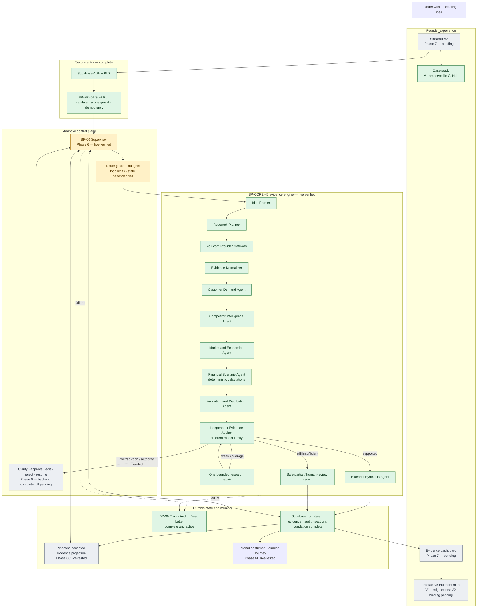
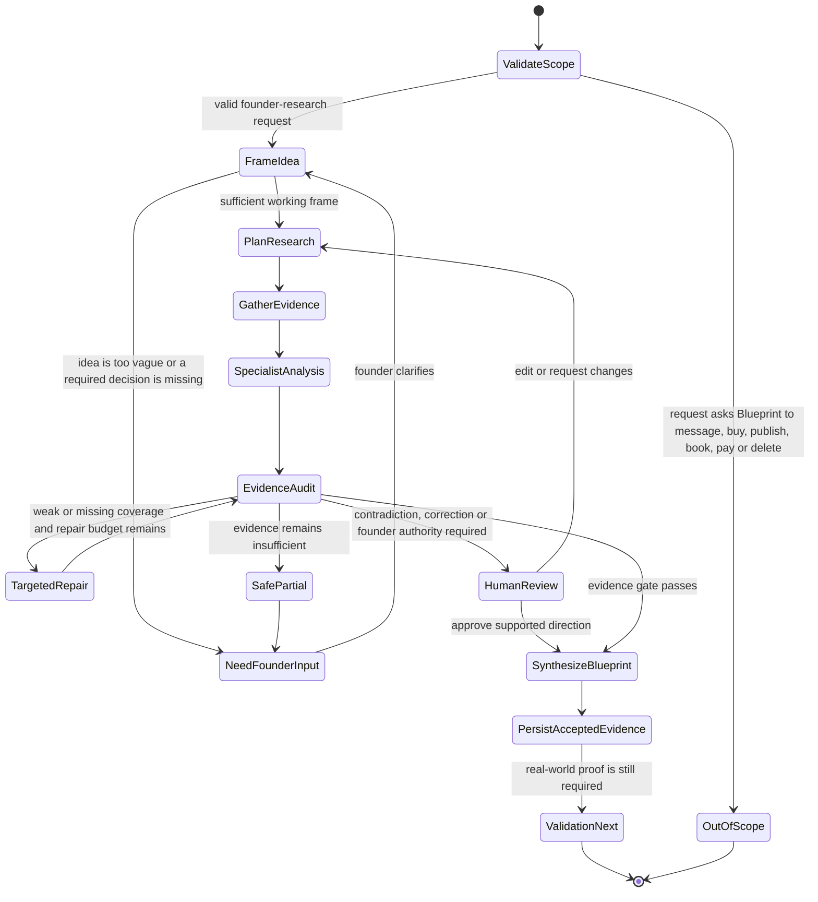
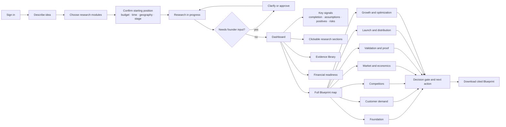

# Blueprint Evidence Dev — Architecture and Product Map

Last updated: 30 August 2026

## Status legend

- **Complete:** implemented and verified through a named test or live n8n execution.
- **In progress:** the design and contracts exist, but the complete workflow is not yet acceptance-tested.
- **Pending:** intentionally scheduled for a later phase.

## System architecture and build status

## Runtime orchestration logic

The Supervisor is not a single agent that writes the entire answer. It owns the route and asks narrow agents to perform bounded jobs. The current core workflow is live-verified; Phase 6 makes the routing durable, resumable and human-aware.

## Agent and control catalogue

| Component | Type | What it can do | What it must not do | Status |
|---|---|---|---|---|
| Scope Guard | Deterministic control | Validate the contract, allow founder research, deny unrelated actions | Contact, purchase, publish, book, pay or delete | Complete |
| Supervisor | Orchestrator | Read run state, select the next eligible agent, enforce budgets, pause/resume and choose a terminal route | Invent research or bypass evidence/HITL gates | Phase 6 live-verified; authenticated persistence acceptance pending |
| Idea Framer | Fast reasoning agent | Convert a vague-but-usable idea into customer, problem, outcome, assumptions, missing questions and search terms | Present assumptions as facts | Complete |
| Research Planner | Deterministic/LLM-assisted planner | Create bounded customer, competitor and market queries within provider limits | Search indefinitely or silently expand scope | Complete |
| Provider Gateway | Tool adapter | Call You.com, classify provider failures and normalize responses | Treat provider output as automatically trusted | Complete |
| Customer Demand Agent | Specialist | Identify reported pain, workflows, alternatives, segments and directional demand signals | Claim real WTP without behavioral/payment evidence | Complete |
| Competitor Intelligence Agent | Specialist | Compare direct/indirect alternatives, positioning, public features, pricing claims, strengths and gaps | Invent private metrics or unsupported competitor capabilities | Complete |
| Market and Economics Agent | Specialist | Summarize category structure, drivers, constraints, business-model signals and unknowns | Invent TAM/SAM/SOM or forecasts | Complete |
| Financial Scenario Agent | Deterministic calculator | Calculate staged budgets, reserve, runway and break-even scenarios from founder inputs | Perform arithmetic through an LLM or present a scenario as financial advice | Complete |
| Validation and Distribution Agent | Specialist | Propose first-user channels, falsifiable experiments, thresholds, cost caps and launch hypotheses | Send outreach, recruit, buy ads or run experiments without approval | Complete |
| Evidence Auditor | Independent verifier | Test citation relevance, source limitations, coverage and contradictions; accept/reject evidence IDs | Add new research or accept plausible unsupported claims | Complete |
| Repair Router | Bounded feedback control | Run exactly one targeted search for the weakest stream and re-audit | Loop without limit | Complete |
| Blueprint Synthesis Agent | Strong synthesis agent | Produce an actionable, cited, idea-specific blueprint with assumptions and unknowns separated | Reintroduce rejected claims or fabricate certainty | Complete |
| BP-90 | Operational safety workflow | Record failures, audit transitions and dead letters; move exhausted runs to safe failure | Expose secrets or silently swallow failures | Complete |
| Human Checkpoint | Control/HITL | Ask a precise question and support approve, edit, reject, request changes, cancel and resume | Let an agent exercise founder authority | Backend complete; authenticated UI acceptance pending |
| Accepted-evidence Memory | Retrieval memory | Store only audited evidence in project-isolated Pinecone namespaces, revalidate against Supabase and degrade safely | Store rejected/untrusted excerpts as reusable truth | Phase 6C live-tested |
| Founder Journey Memory | Personalization memory | Store only confirmed goals, preferences, constraints, decisions, corrections, lessons and episode summaries | Replace canonical profile/run state or store raw reasoning/logs | Phase 6D live-tested; UI controls pending |
| Profile Rerun Controller | Deterministic/HITL control | Version profile edits, preview dependency impact, require approval and create targeted/full task plans | Overwrite prior Blueprints or silently rerun costly work | Phase 6E2 backend complete; authenticated UI acceptance pending |

## Founder-facing product flow

The V2 **Blueprint** page should retain the professional connected-decision map from V1, but its nodes must be generated from real Supabase state rather than Streamlit session-state estimates.

Each map node opens a detail view containing: status, agent-completed work, accepted citations, rejected/limited evidence, calculations, assumptions, open risks, founder questions, dependencies and the next permitted action. The map must distinguish `AGENT_DONE` from `COMPLETED`.

## UI and integration sequencing decision

1. Collect and freeze navigation, dashboard sections, information hierarchy and required interactions **now**. These choices can affect the Phase 6 response and persistence contracts.
2. Build Phase 6 Supervisor/HITL against those contracts. Do not pause it for typography, colors or card styling.
3. At the start of Phase 7, apply the structural dashboard changes before binding screens to live Supabase/n8n data. This avoids integrating screens that will immediately be reorganized.
4. Bind the revised UI to Auth, Start Run, status, clarification, approval, evidence, finance and blueprint APIs.
5. Apply final responsive and visual polish only after the end-to-end path works.

Therefore, dashboard suggestions should be supplied before Phase 6 is finalized. Structural UI changes happen at the beginning of Phase 7; cosmetic polish happens after integration.

## V1 preservation decision

Blueprint V1 is the repository `https://github.com/kajalchourasia-cmd/blueprint`. Its clean local checkout points to that repository, and the V1 case-study page is tracked at `pages/6_🧭_Case_Study.py`. The original interactive map is tracked at `blueprint/blueprint_map.py`.

V1 remains unchanged as the product-history record. V2 belongs in `blueprint-v2` and must preserve V1 through documentation rather than overwriting it. Before final submission, V2 will include:

- `docs/v1-case-study/` containing the preserved case-study source/content or an approved archival snapshot;
- `docs/V1-TO-V2.md` explaining what V1 proved, what V2 changes and why;
- a visible Case Study navigation entry in Streamlit V2;
- the V2 architecture, agent map, build history, iterations, evaluation results and demo evidence;
- a link back to the immutable V1 repository and deployed V1 demo.
