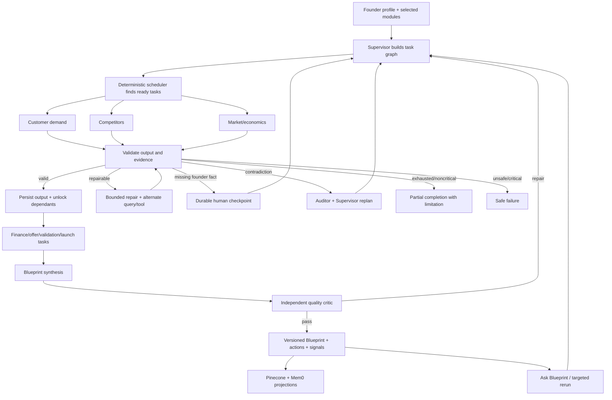

# Blueprint Evidence Dev — Authoritative Build Plan

> Version: 1.2 — Phase 7 closed-path and guest-demo revision
> Updated: 30 August 2026  
> Authority: this document supersedes older phase/status statements in `README.md`, `blueprint.md`, and `implementation-plan.md`. Those files remain useful design history.  
> Product: a dynamic, evidence-first founder validation system—not a generic market-research report generator.

## 1. The product we are building

> **Latest implementation evidence:** [Phase 7 closed Streamlit-to-n8n path](phase-7-closed-loop-evidence.md). The visible login/logout requirement was removed after the original plan: Blueprint now uses an invisible, owner-isolated Supabase guest session. Stage 1 is live-verified through its founder checkpoint; Stage 2/3 are built and published but require the founder's real Gate 1 decision before production acceptance.

A founder enters an idea, goal, constraints, available budget, progress already made, and the research modules they want. Blueprint creates a project-specific validation roadmap, researches the selected questions, preserves source-level evidence, challenges weak conclusions, and returns a versioned Blueprint with detailed sections, risks, assumptions, financial scenarios, founder actions, and the next best step.

The roadmap is generated from the founder's goal and evidence. It is not a fixed A-to-B-to-C pipeline. Tasks run only when their dependencies and evidence needs justify them; independent tasks may run in parallel; weak or contradictory results route to repair, clarification, human review, partial completion, or safe failure.

### Frozen founder-facing sequence — added after the original plan

The authoritative user journey is [Frozen Founder User Flow](frozen-founder-user-flow.md). The product is sequential at evidence gates but parallel within a stage:

1. The founder enters an idea and selects only **User Research**, **Competitor Research**, and/or **Market Research**; all three are selected by default.
2. Selected research runs in parallel and becomes readable section by section.
3. An audited, deterministic Research Viability Score produces `STRONG_GO`, `CONDITIONAL_GO`, `HOLD_OR_PIVOT`, `INSUFFICIENT_EVIDENCE`, or `LIMITED_VERDICT`.
4. Scores below 60, missing research, insufficient evidence, or critical contradictions stop at a human checkpoint. The founder may validate, continue with a recorded override, or pause/revise.
5. Only after that checkpoint does Blueprint create goal-specific proof, business/revenue model, financial, operating, first-customer, launch, fundraising-readiness, or other work.
6. A separate Execution Readiness gate controls completion of the advisory Action Blueprint. Blueprint then provides MVP, first-customer, distribution, money-flow, milestone, fundraising-readiness when applicable, and growth guidance; it does not execute or manage the launch.

The “60” is not a percentage chance of success. It is a versioned readiness score calculated from audited evidence. Evidence sufficiency is a separate hard gate.

## 2. Version boundaries

### V1 — required hackathon product

- Founder onboarding with an idea and three visible initial research choices: User, Competitor, and Market Research. Goal, constraints, budget, stage, and progress are optional enrichments; a missing goal is handled explicitly rather than blocking Stage 1.
- Dynamic roadmap and project-specific dashboard signals.
- Detailed Blueprint sections: foundation, customer demand, competitors, market economics, offer/pricing, assumptions/risks, operating model, financial readiness, validation/proof, launch/distribution, and growth/optimization.
- Supervisor planning and scheduling, bounded research specialists, evidence auditor, Blueprint synthesizer, and independent quality critic.
- You.com and direct-source web research, explicit citations, limitations, freshness, and conflict handling.
- Scenario-based financial planning; no fabricated precision or investment advice.
- Section-level next actions, targeted reruns, full reruns, profile editing, and impact preview.
- Supabase canonical state, Pinecone accepted-evidence retrieval, and Mem0 founder-journey memory.
- “Ask this Research” is a scoped V1 retrieval layer over the current run's dynamic task outputs, immutable Blueprint, verdict, actionables, and accepted evidence. Research reruns require impact preview and explicit founder approval.
- Human approval for writes or consequential actions; autonomous reads.
- Tool-failure handling, retry budgets, checkpoints, resumability, observability, and end-to-end evaluations.
- Streamlit integration and submission/demo package.

### V2 — deliberately deferred

- Founder document upload and ingestion through Supabase Storage.
- LlamaIndex parsing/chunking, page-level provenance, and uploaded-document RAG.
- Optional voice input/output.
- Broader external actions or integrations after explicit approval design.

## 3. State and memory authority

| System | Authoritative responsibility | Failure policy |
|---|---|---|
| Supabase | Users, projects, profile versions, runs, tasks, evidence, Blueprint versions, approvals, checkpoints, actions, signals, audit/eval records | Canonical and required |
| Pinecone | Rebuildable semantic projection of accepted evidence and completed Blueprint sections | Retrieval degrades gracefully; never canonical |
| Mem0 | Rebuildable founder-journey memory: confirmed goals, preferences, constraints, decisions, corrections, and episode summaries | Personalization degrades gracefully; never canonical |
| n8n | Control plane: planning, scheduling, tool calls, repair loops, handoffs, HITL, and persistence | Resume from durable state |
| Nebius | Model inference for structured planning, synthesis, audit, and critique | Treat output as untrusted until validated |

We do not store hidden chain of thought. We store compact decision records: inputs, selected route, reasons, sources, verdicts, limitations, and outcomes.

## 4. Agent and workflow boundaries

Use an agent only where the next action depends on context and evidence. Use deterministic workflow/code for identity, authorization, state transitions, dependency checks, arithmetic, budgets, idempotency, and schema validation.

| Component | Role | Current truth |
|---|---|---|
| Supervisor | Creates and revises the task graph, chooses eligible specialists, and decides repair/HITL/partial/safe-fail routes | Planner, adapter-aware scheduler and bounded re-evaluation workflow are live-safe; durable checkpoint resume is Phase 6E1 |
| Foundation framer | Converts idea/profile into problem, audience, goal, constraints, and hypotheses | Baseline logic exists in `BP-CORE-45` |
| Customer-demand specialist | Finds real pains, alternatives, willingness-to-pay signals, segments, and first-user channels | Baseline exists; dynamic contract pending |
| Competitor specialist | Discovers direct/indirect/status-quo competitors, positioning, pricing, praise, complaints, gaps, and opportunities | Baseline exists; dynamic contract pending |
| Market/economics specialist | Market structure, trends, constraints, and defensible ranges | Baseline exists; dynamic contract pending |
| Financial scenario engine | Deterministic runway, pricing, break-even, and scenario calculations with stated assumptions | Pending dynamic implementation |
| Evidence auditor | Independently checks stream completion, citation allowlists, coverage, contradictions and verdict sufficiency | `BP-AUDIT-01` is imported and live-safe verified; production evidence run pending |
| Blueprint synthesizer | Creates immutable Research Blueprint V1 from audited Stage 1 sections and verdict | `BP-SYNTH-01` is imported and live-safe verified; production persistence path is bound |
| Independent critic | Scores completeness, grounding, contradictions, actionability, and safety; cannot self-approve | Baseline quality gate exists |
| Ask this Research | Project-grounded explanation/actionable coach over accepted run evidence; may propose but never silently execute a rerun | Streamlit integration and `BP-CHAT-01` retrieval context are complete; live authenticated answer acceptance remains |
| Memory adapters | Project accepted evidence to Pinecone and confirmed founder journey to Mem0 | `BP-PINE-01` and `BP-MEM0-01` imported; both add/search/delete acceptance paths passed live with scoped cleanup |

`BP-PLAN-01 Dynamic Task Planner` was added after the original workflow set and passed its original safe fixture. The later frozen user flow now requires a controlled revision: it must plan only Stage 1 research initially, allow a missing founder goal, insert the Research Verdict checkpoint, and plan later modules only after the gate decision. Its deterministic dependency and persistence mechanisms remain valid.

## 5. Dynamic orchestration loop

This is agentic because routes depend on observed state—not because every node is an LLM call.

## 6. Founder-facing output contract

Every included Blueprint section must contain:

1. Executive answer and why it matters to this founder's stated goal.
2. Detailed findings in an appropriate table or structured view.
3. Claim-level sources with date, relevance, and confidence.
4. Assumptions, conflicts, limitations, and unanswered questions.
5. Three to five prioritized next actions with owner, effort, horizon, success metric, and prerequisites.
6. A rerun control and the predicted downstream impact before execution.

The dashboard shows only project-relevant signals, selected by deterministic rules and traceable formulas. Typical categories are Research Viability, evidence coverage, completion, open critical risks, runway, validation readiness, or confirmed goal progress. Conversion rate is shown only from real founder-supplied numerator/denominator observations with a time window and sample size; research alone never changes it.

## 7. Safety, autonomy, and failure rules

- Autonomous: read/search, retrieve project state, calculate scenarios, draft analysis, propose actions.
- Human approval required: changing profile truth, rerunning costly/full research, publishing/sending, spending, deleting, or any external write.
- Prohibited: inventing sources, claiming interviews that did not happen, financial guarantees, unrelated messaging/actions, exposing another user's state, or treating Mem0/Pinecone as canonical.
- Empty search: broaden query once, try an alternate source, then return an explicit evidence gap.
- Tool failure: bounded exponential retry, fallback where safe, persist the error, then route to partial/HITL/safe fail.
- Invalid model output: schema repair at most twice; never silently coerce material claims.
- Contradictions: preserve both claims, request stronger evidence, lower confidence, and replan if decision-critical.
- Every run is resumable and idempotent. Every route records reason, attempt count, tool/model, latency, and terminal status.

## 8. Implementation truth as of 30 August 2026

### Complete and verified

- Persistent self-hosted n8n and credentials.
- Supabase foundation migrations 001–008, RLS, ownership, run/evidence/section/approval/chat/audit tables.
- You.com, Nebius, Pinecone, Supabase, and Mem0 access/credentials.
- Authenticated/idempotent API baseline and BP-90 error/audit writer.
- 42-node `BP-CORE-45` sequential evidence-to-Blueprint baseline; live execution 201 passed.
- Baseline `BP-00`, `BP-QA-01`, `BP-CHAT-01`, and `BP-API-01` workflows.
- Dynamic JSON contracts and boundary documentation.
- Dynamic Supabase state migration 009: versioned profiles/Blueprints, task graph, observations, HITL checkpoints, actions, signals, reruns, and memory projections; all verification gates passed.
- Progressive-state migration 011: append-only stage verdicts, Original/Research/Action Blueprint classifications, stage progress, measured-only KPI observations, and two-gate HITL vocabulary; all verification gates passed.
- `BP-VERDICT-01 Research Viability Gate`: deterministic 40/30/30 scoring, evidence/audit sufficiency rules, founder popup contract, and Supabase checkpoint persistence; safe fixture passed live.
- Gate-aware `BP-PLAN-01`: Discover/Prove-and-Design/Complete-Action-Blueprint graphs, deterministic gate locks, goal branching, pause/replan behavior, and advisory-only Stage 3; live Discover fixture plus 7/7 branching regressions passed.
- Supabase migrations 012–013: version-exact execution context, observable run snapshots, and adapter-aware atomic task claiming; both verification suites passed 2/2.
- `BP-STAGE1-01`: bounded parameterized Foundation/User/Competitor/Market specialist with provider, grounding, citation, repair, refusal and safe-test branches; safe fixture passed live.
- `BP-SCHED-01`: multi-item claim/context/dispatch/observe/unlock cycle for currently installed Stage 1 adapters; two-task fan-out passed live with two preserved observations.
- Phase 7A canonical start migrations 019–020 are installed: authenticated start atomically creates profile v1 and Original Blueprint, idempotent replays accept in-flight statuses, and the owner-scoped RAG/rerun context is live.
- `BP-API-01` now dispatches the same `bp00Supervisor` ID into the dynamic Planner → Scheduler → Specialist/Router → Auditor → Verdict → Synthesizer → re-evaluation loop. The controller is capped at 12 scheduling cycles and fails visibly.
- Stage-gate precedence was corrected: the immutable Research Blueprint is synthesized before a pending Stage 1 checkpoint blocks later work; a generic READY task still cannot bypass HITL.
- `BP-API-02` exposes authenticated research-rerun preview/approve/cancel. Approval creates a new run and dispatches it through the same dynamic Supervisor; chat never directly auto-approves the write.
- Streamlit renders the live Research Blueprint sections, sources, risks, unknowns, contextual actions, grounded research chat, and rerun approval controls ahead of the existing dashboard redesign layer.
- Repeatable workflow/component evaluation now passes **77/77**; Python auth/backend contracts pass **9/9**; all three production webhooks reject missing authentication with `401`.

### Built, with final acceptance still pending

- One founder-approved continuation from the live Gate 1 popup through Stage 2, Gate 2, and the Action Blueprint.
- A real second anonymous-user isolation denial test.
- Public HTTPS hosting for n8n, followed by Streamlit Community Cloud deployment.
- Final submission assets and demo recording.

## 9. Revised build phases

| Phase | Deliverable | Status | Estimate |
|---|---|---:|---:|
| 0 | Scope, handout/checklist, V1/V2 boundary | Complete | — |
| 1 | Repo, persistent n8n, provider readiness | Complete | — |
| 2 | Supabase security/state foundation and BP-90 | Complete | — |
| 3 | Authenticated intake/API baseline | Complete; Streamlit JWT remains | — |
| 4 | Sequential evidence/research baseline | Complete | — |
| 5 | Baseline Supervisor, QA, quality gate, and chat | Complete as baseline | — |
| 6A | Dynamic state contracts: profile, task graph, observations, checkpoints, actions, signals, reruns, memory projections | **Database complete; n8n binding begins in 6B** | Complete |
| 6B | Staged Supervisor, three-stream research, independent audit, verdict, immutable Research Blueprint V1, scheduler, typed router and bounded re-evaluation | **Component-complete and live-safe verified; authenticated end-to-end acceptance waits for Phase 7 UI/JWT binding** | Complete for safe/component scope |
| 6C | Pinecone evidence projection; Ask Blueprint/RAG product integration | **Accepted-evidence projection/revalidation complete and live-tested; founder-facing chat remains held** | Core complete |
| 6D | Mem0 founder-journey retrieve/write integration | **Confirmed-memory adapter complete and live-tested; UI inspect/correct controls remain Phase 7** | Core complete |
| 6E1 | Durable founder checkpoint decision, idempotent resume and stale-decision protection | **Backend and live-safe contract complete; authenticated UI acceptance remains** | Complete |
| 6E2 | Profile edit, impact preview, targeted/full rerun | **Backend complete and safe-plan live-tested; authenticated UI acceptance remains** | Core complete |
| 6F | Failure handling, observability, budgets, safe/partial completion | **Complete and live-safe verified: migration 018 installed; shared resilience controller published; 15/15 injected failures passed** | Complete |
| 6G | Evals: routing, grounding, isolation, failures, workflow completion | **Complete for backend/component scope: actual exported Code nodes plus structural/security contracts pass 68/68** | Complete |
| 7A | Invisible anonymous JWT, immutable initial state, canonical n8n entry | **Complete and live-verified from a fresh browser session; no login UI** | Complete |
| 7B | Dynamic main-path convergence and bounded re-evaluation | **Implemented and published in place under `bp00Supervisor`** | Complete |
| 7C | Codex-style Streamlit progress, sections, sources, actionables, section chat, rerun and checkpoints | **Implemented and live-verified through Gate 1** | Complete for Stage 1; Stage 2/3 acceptance pending click |
| 7D | Routing/grounding/failure/HITL/isolation/completion/rerun evals | **77/77 workflow/component + 9/9 Python PASS; real two-user journey remains** | Component complete |
| 7E | Section-scoped Ask this Research plus approval-gated reruns | **Implemented and webhooks published; real chat/rerun write acceptance remains founder-controlled** | Component complete |
| 8 | Requirement audit, demo fixtures, case study, README, submission | Pending | 2–3 h |
| Product V2 | File upload, LlamaIndex document RAG, optional voice | Deferred | Post-hackathon |

Execution order: **6A → 6B → 6E1 → 6C → 6D → 6E2 → 6F → 6G → 7 → 8**. Phase 6A–6G is now backend/component complete. The next build target is Phase 7 authenticated Streamlit integration; Phase 8 then covers final end-to-end hardening and submission assets.

## 10. Additions made after the original plan

| Later addition | Decision and reason |
|---|---|
| Dynamic Blueprint roadmap | Added: every founder's goal and evidence produce a different task graph and section set. |
| Detailed clickable section reports | Added: summaries alone are insufficient; each section has findings, sources, limitations, and actions. |
| Dynamic signals/KPIs | Added: signals are selected from the founder's actual goal and state, not fixed vanity metrics. |
| Profile versioning and rerun impact | Added: edits must preserve history and preview which tasks/sections become stale. |
| Ask Blueprint | Designed with strict project-grounded boundaries, then deliberately held until the core staged product is complete. |
| Advisory-only Stage 3 | Added later: Blueprint supplies MVP, first-customer, distribution and milestone guidance but does not execute a launch or manufacture weekly work. |
| Progressive Blueprint versions | Added later: immutable Original/V0, Research/V1 and Action/V2 artifacts can be opened or compared. |
| Conversion KPI rule | Added later: conversion rate is hidden until real founder-supplied funnel counts exist. |
| Pinecone RAG | Added to V1 only for accepted live evidence and Blueprint sections. |
| Mem0 | Added for confirmed founder-journey memory across sessions; Supabase remains canonical. |
| Three-layer memory | Clarified: Supabase canonical, Pinecone evidence projection, Mem0 journey projection. One service cannot safely replace all three responsibilities. |
| Blueprint versions | Added so founders can compare how evidence and decisions changed over time. |
| File/document RAG with LlamaIndex | Moved to V2 to protect the V1 critical path. |
| Voice | Deferred to V2; it does not improve the core measured workflow enough for the current deadline. |
| Staged research verdicts | Added: User/Competitor/Market Research form Stage 1, followed by a deterministic viability gate and founder decision before later Blueprint work. |
| Goal-specific later stages | Added: first paying customers, side income, financial relief, launch, fundraising readiness, and growth produce different downstream task graphs. |
| Missing-goal behavior | Added: Stage 1 may run with a temporary validation objective, but goal-specific Stage 2 remains gated until the founder confirms or accepts validation-first planning. |

## 11. Immediate build step

Migrations 011–020 and the Stage 1/HITL/memory/rerun/resilience components are installed. The public start, chat, and rerun webhooks are published and authenticate with the founder's Supabase JWT. The repeatable evaluator passes 77/77 and the Streamlit auth/backend suite passes 9/9. The immediate next step is a signed-in golden journey: start one idea, watch all selected research tasks complete, inspect the Research Blueprint and sources, ask a grounded question, preview/approve one rerun, then repeat the isolation check with a second user. After that, Phase 8 packages deployment, final checklist evidence, demo fixtures, and submission assets.
