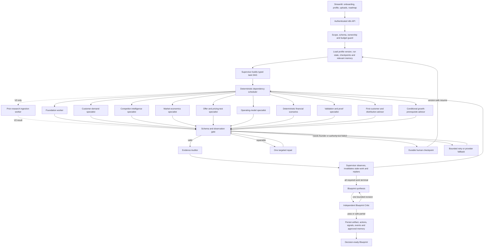

# Blueprint Evidence Dev — Dynamic Orchestration and Memory Specification

Date: 30 August 2026  
Status: approved target design; Phase 6A–6E backend implemented, with Phase 6F/6G hardening/evals and Phase 7 UI binding still to be completed

The definitive one-liner, handout framework, autonomy boundaries, memory duration, version identity, research/chat limits and failure/HITL matrix are in `agent-framework-and-boundaries.md`.

The founder-facing stage and verdict behavior was frozen later in [frozen-founder-user-flow.md](frozen-founder-user-flow.md). Where an earlier “Everything” or all-module example in this document conflicts with that flow, the frozen user flow wins.

## Definitive product decision

Blueprint is not a fixed ten-step course and it is not a collection of agents that always run in the same order. It is a staged, goal-driven founder research system. The founder supplies an idea and initially selects User Research, Competitor Research, Market Research, or all three. A goal and constraints improve routing but are not required to start Stage 1. Later modules are considered only after the Research Verdict Gate and founder decision.

For each project, the Supervisor creates a versioned task graph. A module may be `RUN`, `REUSE`, `WAIT`, `BLOCKED`, `NOT_APPLICABLE`, or `NOT_REQUESTED`. The graph, roadmap, dashboard signals, action plan, and final Blueprint are therefore different for every founder.

## System architecture

The Supervisor decides **what work is needed and what becomes eligible next**. The deterministic scheduler decides **which eligible tasks can run safely now**. Specialists do bounded research or analysis. They cannot create arbitrary agents, mutate shared state, or perform external business actions.

## Founder onboarding and profile contract

The profile is versioned and contains:

- idea, optional industry, current stage, target customer hypothesis and geography;
- goal type, target value, unit and horizon—for example 20 paying customers in 90 days, validate demand in 14 days, launch readiness, fundraising readiness, or a custom goal;
- selected modules, with `ALL` as the default;
- available budget, founder time, team/capabilities, risk tolerance and preferred research depth;
- prior work, known competitors, existing evidence and uploaded document IDs;
- success definition, constraints, exclusions and explicit founder corrections.

The planner never assumes that all goals require the same roadmap. Unknown information remains unknown. When a material field is missing, it asks one focused question and creates a resumable checkpoint instead of guessing.

## Dynamic module catalogue and dependencies

| Module | Eligibility and principal dependencies | Typical terminal condition |
|---|---|---|
| Foundation | Always considered first; may reuse verified founder material | Stable problem, customer, job, goal and constraints or a founder clarification checkpoint |
| Customer demand | Foundation stable; may run in parallel with competitor and initial market work | Evidence-backed pains, alternatives, demand and WTP level, gaps and next actions |
| Competitor intelligence | Foundation stable; parallel-safe with customer discovery | Verified direct, indirect, service, manual and non-consumption alternatives with gaps and wedge actions |
| Market economics | Foundation stable; calculations wait for usable segment and pricing/cost assumptions | Audited market shape/ranges, assumptions and unknowns; no invented TAM |
| Offer and pricing test | Customer + competitor signals and founder constraints available | Testable offer, price hypotheses, pass/fail thresholds and actions—not a claimed optimal price |
| Assumptions and risks | Cross-cutting projection recomputed after every accepted result | Ranked open assumptions, contradictions, severity, evidence and owner/action |
| Operating model | Foundation plus delivery/team/budget constraints; research modules when materially relevant | Feasible make/buy/manual/automated operating choices and risks |
| Validation and proof | Ranked assumptions and evidence gaps exist | Smallest useful experiments, owners, cost/time and measurable pass/fail criteria |
| Financial readiness | Offer/pricing, cost, budget and scenario inputs available | Deterministic runway, break-even and sensitivity scenarios with explicit assumptions |
| MVP, first customers and distribution | Customer/channel evidence plus offer and validation state | Evidence-based MVP scope, first-user routes, distribution guidance and milestone roadmap; no launch execution or weekly task program |
| Growth guidance | Requires actual launch/traction evidence for metric-specific advice | Contextual growth prerequisites and tips when pre-traction; measured growth guidance only when real observations exist |
| Final Blueprint | All required modules reach a safe terminal state | Audited synthesis, limitations, dynamic signals and prioritized actions |

Selecting all three initial research streams does not authorize every downstream Blueprint module. The Supervisor first creates Foundation plus the three selected research tasks and Evidence Audit. Later finance, operating, validation, launch, fundraising-readiness, or growth tasks are generated only after the verdict checkpoint and according to the confirmed goal. A skipped or deferred module must include a visible reason.

## Task graph and closed-loop routing contract

Every task contains `task_id`, `run_id`, `profile_version`, `module_key`, `goal`, `status`, `dependency_ids`, `input_refs`, `output_schema_version`, `allowed_tools`, `model_role`, budgets, completion criteria, retry policy, observation verdict and route reason.

The scheduler may run every `READY` task whose dependencies are terminal and whose tools are permitted. After every result, the observation gate returns exactly one of:

- `VALID`: audit and unlock dependants;
- `NEEDS_REPAIR`: run one narrower retrieval or schema repair;
- `NEEDS_INPUT`: create a durable human checkpoint;
- `CONTRADICTORY`: send to the auditor and possibly human review;
- `TOOL_FAILED`: capped retry, provider fallback, or safe partial;
- `NOT_APPLICABLE`: close the task with a reason;
- `POLICY_DENIED`: produce a safe, explicit denial;
- `BUDGET_EXHAUSTED`: preserve best partial work and terminate visibly.

The Supervisor then recalculates dependencies and priorities. It may add an allowlisted task, invalidate downstream tasks, reuse unaffected results, or synthesize. It cannot create arbitrary agent types. Loops are capped by task retries, search cycles, Blueprint revisions, transitions, cost and wall-clock time.

A run closes only when every required task is `COMPLETED`, `REUSED`, `NOT_APPLICABLE`, or has an explicit safe terminal outcome such as `PARTIAL`, `NEEDS_HUMAN`, `SAFE_FAILED`, or `CANCELLED`. There is no silent hanging state.

## Dynamic roadmap and section states

The Streamlit roadmap renders the task plan returned by the backend. It must not hard-code ten cards. Supported section states are:

`NOT_REQUESTED`, `PLANNED`, `BLOCKED`, `READY`, `RUNNING`, `AGENT_DONE`, `NEEDS_INPUT`, `HUMAN_REVIEW`, `COMPLETED`, `PARTIAL`, `STALE`, `NOT_APPLICABLE`, `SAFE_FAILED`, and `CANCELLED`.

Each section exposes findings, accepted and opposing evidence, assumptions, limitations, unanswered questions, action plan, upstream dependencies, last profile version and rerun eligibility. `AGENT_DONE` is not the same as `COMPLETED` when human input, evidence repair, or approval is outstanding.

## Detailed section-output contract

Clicking a roadmap item opens a full research workspace, not a short agent summary. Every module page uses the same outer contract:

1. executive finding and why it matters to the founder's stated goal;
2. detailed structured research and appropriate comparison tables;
3. accepted, opposing and insufficient evidence with source links;
4. facts, inferences, assumptions and unknowns clearly separated;
5. confidence/coverage and any human questions still required;
6. one to three ranked next actions;
7. module history, profile version, last run time and limitations;
8. `Rerun this module` control with an impact preview before execution.

The content inside that shell is module-specific:

| Section | Required detailed content |
|---|---|
| Foundation | Idea thesis, founder goal, stage, customer/problem hypotheses, job-to-be-done, outcome, geography, business-model hypothesis, founder/team/time/budget constraints, existing assets, success criteria, riskiest assumptions, scope exclusions, missing questions and dependency map |
| Customer research | Up to five evidence-backed customer segments/personas, jobs, pains, triggering events, current workflows/workarounds, consequence/frequency, buying roles, switching barriers, communities/first-user locations, WTP evidence, opposing signals and interview/experiment plan |
| Market research | Segment definition, market structure, trends/drivers, category maturity, constraints/regulation where relevant, bottom-up ranges, accessible beachhead, source quality, sensitivities and unresolved market assumptions |
| Competitor research | Verified direct, indirect, service, manual and non-consumption alternatives; target, promise, MVP mechanism, features, pricing, positioning, distribution, customer praise/complaints, strengths, weaknesses, defensibility, gaps and founder opportunities |
| Offer/pricing | Offer hypotheses, value proposition, packaging/tier options, price assumptions, evidence level, objections, differentiation, test design and pass/fail thresholds |
| Operating model | Delivery model, make/buy/manual/automated choices, capability and dependency map, key operating costs, capacity constraints, risks and staged operating plan |
| Validation/proof | Ranked assumptions, evidence already held, smallest useful experiments, recruitment channels, scripts/drafts, owners, cost/time, pass/fail thresholds and next decision |
| Financial readiness | Founder inputs, evidence budget, pricing scenarios, unit economics when inputs exist, runway, break-even, staged capital release, sensitivity and explicit unknowns; always labelled planning scenarios |
| MVP/first customers/distribution | MVP boundary, ICP/channel hypotheses, first-user sourcing, distribution options, milestone sequence, messages as drafts only, measurement prerequisites and risks; no launch execution or weekly schedule |
| Growth guidance | Only when traction exists: activation/retention/channel evidence, constraints and measured opportunities; otherwise advisory prerequisites and tips with `WAIT`/`NOT_APPLICABLE` for metric-specific analysis |
| Final Blueprint | Cross-module evidence graph, contradictions, decision summary, top signals, critical assumptions/risks, financial scenarios, roadmap, next-best actions, limitations, sources and version history |

“Top five customers” means up to five evidence-backed **customer segments or personas**. Blueprint must not invent named customers or pretend public web research was a real interview.

## Dynamic top-five signals

The dashboard does not display five LLM-invented percentages. A deterministic Signal Selection Engine builds a candidate registry, calculates values from audited records, and selects the five most relevant signals using goal, stage, requested modules and evidence availability.

Two stable system signals normally remain visible:

1. Blueprint completion/coverage.
2. Critical open risks or assumptions.

Three slots are goal-specific. Examples include WTP evidence strength, first-user reachability, path to target, runway, monthly break-even customers, experiment readiness, contradiction count, channel evidence, launch readiness, or growth prerequisites. A pre-launch founder does not receive fictional retention or activation KPIs.

Every signal contains `signal_id`, label, value, unit, status, confidence, formula/rule ID, evidence IDs, why it was selected, last-updated time and next action. If the data is unavailable, the value is `unknown` and the next evidence-producing action is shown.

## Action plan after every module

Every specialist output must include one to three executable next actions. Each action contains:

`action_id`, `module_key`, title, why, owner (`FOUNDER` or `SYSTEM`), priority, effort, time horizon, prerequisites, success metric, evidence IDs, status, whether Blueprint may run it, and whether human approval is required.

The Next Best Action projection ranks actions by goal impact, uncertainty reduction, dependency readiness and effort. Blueprint may automatically execute only approved read-only research actions. Interviews, outreach, posting, purchasing, payments, bookings and destructive changes remain founder actions or drafts.

## Profile edits and reruns

The profile page shows every onboarding answer and its source. Editing creates a new immutable `profile_version`; it never rewrites history.

Before rerunning, the backend computes an impact preview:

- changed fields and affected hypotheses;
- outputs that remain reusable;
- downstream tasks that become `STALE`;
- tasks to rerun, estimated calls/time and approvals required.

The founder can choose a targeted rerun or full rerun. Both require an idempotency key and confirmation. Completed unaffected evidence is reused only after freshness and ownership checks. The original Blueprint remains accessible as a previous version.

## RAG and Ask Blueprint — held until the staged core is complete

The core V1 does not depend on a chatbot. First complete Stage 1 research, verdict gating, Stage 2 planning, progressive Blueprint versions, HITL, failures and evaluation. Pinecone may receive accepted evidence projections during that work, but the founder-facing Ask Blueprint/RAG interface is integrated only after the staged end-to-end core passes acceptance.

When enabled later, the assistant may appear at the bottom of the project/section experience and answer questions such as:

- “Why did you classify this as a weak market signal?”
- “Which sources support this competitor's pricing?”
- “What did customer research find about current workarounds?”
- “What would change if my budget becomes ₹100,000?”
- “Why is financial readiness blocked?”
- “What should I do next?”

Answers include evidence IDs/source links, relevant limitations and the Blueprint version used. The assistant may prepare a rerun proposal, but execution requires explicit founder confirmation. It denies unrelated messaging, posting, payment, booking, deletion or general-purpose requests.

## V2 existing-research and document ingestion

In V2, founders may upload PDFs, DOCX, text/Markdown or structured notes before planning or from a module page. Supabase Storage owns the original file and immutable metadata. A bounded LlamaIndex ingestion worker parses supported files, chunks them, attaches project/document/page metadata, deduplicates by document ID/hash and inserts retrievable nodes into the existing Pinecone project namespace. LlamaIndex is an ingestion/retrieval adapter, never the orchestrator.

Uploaded claims are labelled `FOUNDER_PROVIDED` until audited. They do not automatically become truth. The system checks file type/size, ownership, malicious instructions, duplicates, age, citations and contradictions. Retrieval returns document/page references, and accepted claims are resolved back to authoritative Supabase records.

## Three-layer memory decision

Mem0 is included, but it does not replace Supabase or Pinecone.

| Memory layer | Service | Stored content | Not stored |
|---|---|---|---|
| Exact working and episodic state | Supabase | profile versions, task graph, checkpoints, events, tool observations, decisions, corrections, actions and artifacts | Hidden chain-of-thought |
| Accepted semantic research | Pinecone, resolved to Supabase IDs | accepted evidence summaries and audited founder documents with owner/project/run metadata | rejected evidence as truth, secrets, cross-user data |
| Distilled Founder Journey memory | Mem0 | durable goals, preferences, constraints, confirmed decisions, corrections, project episode summaries and useful lessons | canonical run state, raw logs, raw documents, unapproved guesses or hidden reasoning |

Mem0 is read before onboarding prefill, planning, resume, cross-run comparison and Ask Blueprint. Retrieved memory is a suggestion with provenance; it cannot silently overwrite the current profile. Writes occur only after explicit founder input, a founder correction/decision, or a quality-approved completed/partial run. Entries are scoped by founder, app and project/run metadata and must be inspectable, correctable and deletable.

Rejected evidence stays in the Supabase audit ledger with its verdict and reason so the system can explain why it was rejected and avoid repeating a failed route. It never enters accepted semantic memory. New evidence may supersede an old record without deleting history.

## HITL decision points

Human review is required for materially ambiguous onboarding, conflicts in uploaded research, unsupported high-stakes/WTP claims, repeated repairs or provider failures, a material pivot, profile edits that invalidate completed work, experiment acceptance, final go/no-go interpretation, memory correction/deletion and any requested external action.

Supported decisions are approve, reject, edit, request changes, provide more information, retry, escalate, cancel and override-with-reason. Every review packet includes goal, proposal, evidence, limitations, route/tool history, cost consequence and affected downstream work. Resume verifies owner, checkpoint ID, proposal hash, state version and expiry.

Ordinary read-only searches and deterministic calculations do not need approval.

## Evaluation gate

`BP-EVAL-01` must compare the current sequential baseline with the dynamic orchestrator. The suite covers:

- onboarding and goal parsing;
- module selection, skipping and dependency correctness;
- parallel routing, targeted repair, replanning and terminal closure;
- grounding, citation support and actionability;
- signal selection, formulas and provenance;
- profile-edit invalidation and targeted/full reruns;
- document retrieval, deduplication and prompt injection;
- Mem0 retrieval precision, temporal conflicts, irrelevant recall and cross-user isolation;
- HITL decisions, provider failures, malformed output, budgets, cost and latency.

The orchestrated design is accepted only when it improves completion/quality or removes unnecessary calls without unacceptable reliability, latency or cost regression. Failures become versioned fixtures; prompts, policies and routing rules may improve offline. Blueprint must not claim that the model retrains itself.

## Included, deferred and excluded capabilities

- **Included now:** one Supervisor hierarchy over allowlisted specialist subworkflows. This is a shallow hierarchy, not a multi-level agent bureaucracy.
- **Excluded:** peer-to-peer agent negotiation. Supabase and the Supervisor remain the single state and routing authority, avoiding races and contradictory handoffs.
- **Excluded:** arbitrary runtime creation of agents. Tasks are dynamic; agent/tool types are allowlisted and permissioned.
- **Deferred:** ElevenLabs voice input/output. The Streamlit/API contract may reserve a transcript field and microphone adapter, but voice is outside the V1 reliability path.
- **Deferred:** model fine-tuning. First gather eval failures; use retrieval, prompts, schemas and routing fixes. Fine-tune only if repeated labelled failures show a stable model-behaviour gap.
- **Never claim:** online model self-training. The system learns at the harness level through durable memory, feedback, eval fixtures and versioned policies.
- **Optional provider fallback:** Fireworks. Its structured output and tool-calling support are useful, but Nebius already covers the required model roles. Fireworks stays behind a provider adapter and is enabled only if a measured availability/quality/cost need appears.
- **Included narrowly:** LlamaIndex for founder-document ingestion and citation-aware retrieval; it does not control agents.
- **Excluded:** raw chain-of-thought storage. Store concise route reasons, observations, evidence and rubric scores instead.

## Safe parallel Streamlit work

The founder may modify Streamlit in parallel now, provided the UI renders backend contracts rather than hard-coding modules or KPIs. Safe components to build are:

- versioned onboarding/profile editor and `ALL` module selector;
- generic roadmap/section card driven by `module_key`, label, status and dependencies;
- generic signal card driven by signal JSON;
- evidence, assumptions, risks, unknowns and action-plan tabs;
- upload area and document-processing states;
- human-review modal;
- timeline/Founder Journey view;
- Ask Blueprint drawer;
- rerun impact preview with targeted/full rerun controls.

Use mock JSON fixtures until endpoints are wired. Do not change authentication, webhook URLs, status enums or persistence behavior independently; those are shared contracts and must be integrated after Phase 6 contracts are frozen.

## Revised remaining build sequence

| Phase | Backend result | Relationship to existing work |
|---|---|---|
| 6A — contracts | JSON Schemas created for versioned profile, task DAG/observation, detailed section, signal, action and rerun impact; module catalogue plus database/n8n binding remain | Extends existing BP-00/BP-CORE-45 contracts |
| 6B — real orchestration | Specialist subworkflows, dynamic selection, dependency scheduler, safe parallelism and bounded replan loop | Replaces the fixed sequential core as the production route; keeps it as eval baseline |
| 6C — evidence projection | **Backend complete and live-tested:** index accepted evidence in Pinecone with owner/project namespace and Supabase hit revalidation | Founder-facing Ask Blueprint remains held until the staged core passes acceptance |
| 6D — memory | **Backend complete and live-tested:** exact Supabase state plus bounded Mem0 Founder Journey add/search/delete | Temporal-conflict and cross-user isolation remain 6G eval cases |
| 6E — HITL and rerun | **Backend complete:** durable review/checkpoint/resume plus immutable profile edit, impact preview and targeted/full rerun controls | Authenticated Streamlit acceptance remains |
| 6F — reliability | Error branches, cancellation, observability, cost/latency and owner-scoped debug projection | Hardens existing BP-90 and traces |
| 6G — eval gate | Baseline-vs-orchestrator, routing, signal, memory and failure regression suite | Required before declaring Phase 6 complete; chatbot/RAG evals are added when that interface is enabled |
| 7 — Streamlit | Bind the parallel UI work to authenticated APIs and run one end-to-end acceptance case | Starts after 6A contracts; final wiring after 6G |
| 8–9 — submission | Case study, diagrams, sample runs, metrics, sanitized repository and demo | Scheduled after product acceptance |
| V2 — founder documents | Upload UI, Supabase Storage, LlamaIndex parse/chunk/deduplicate, prompt-injection checks, Pinecone retrieval and page-level citation revalidation | Planned extension after the submission-grade V1 is frozen |

Phase 6 is not complete until 6A–6G pass. Phases 6A–6E now provide the dynamic backend; 6F failure/observability hardening and 6G repeatable evaluations remain before the full Phase 6 claim.

## Technical references

- [Mem0 memory types](https://docs.mem0.ai/core-concepts/memory-types)
- [Mem0 scoped memory search](https://docs.mem0.ai/core-concepts/memory-operations/search)
- [Mem0 memory evaluation](https://docs.mem0.ai/core-concepts/memory-evaluation)
- [LlamaIndex ingestion pipeline and document management](https://docs.llamaindex.ai/en/v0.10.17/module_guides/loading/ingestion_pipeline/root.html)
- [Fireworks structured outputs](https://docs.fireworks.ai/structured-responses/structured-response-formatting)
- [Fireworks tool calling](https://docs.fireworks.ai/guides/function-calling)
- [ElevenLabs agent workflows](https://elevenlabs.io/docs/eleven-agents/customization/agent-workflows)
