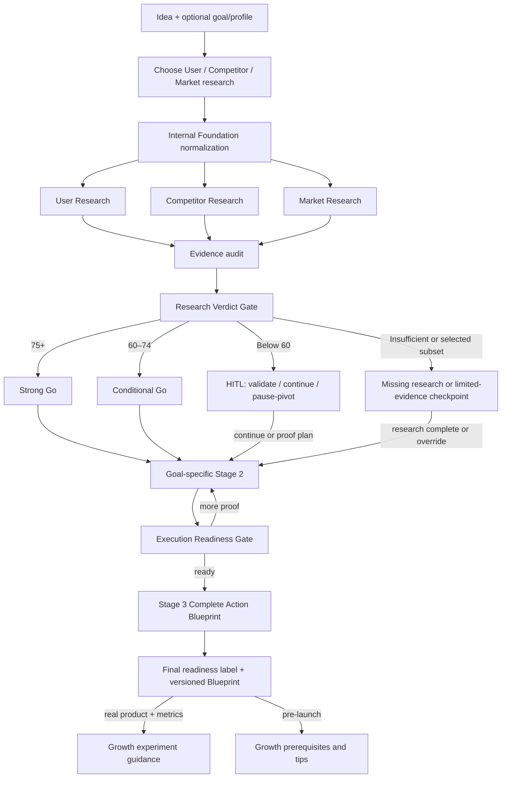

# Blueprint Evidence Dev — Frozen Founder User Flow

> Version: 1.0  
> Frozen: 30 August 2026  
> Status: approved product flow to be implemented before further Phase 6 work  
> Important: product stages below are founder-facing stages. They are different from engineering build phases 0–8.

## 1. Product promise

Blueprint does not give a founder one giant report and a generic “go/no-go.” It guides the founder through evidence gates. Each gate shows what is known, what remains uncertain, what the founder should do next, and whether later planning is justified.

The founder can read completed research while later approved work is still running. A later stage never hides or replaces the earlier evidence.

## 2. Onboarding

The minimum required input is one clear idea. Industry is optional.

The UI exposes only three initial research choices:

1. **User Research** — desk research into pains, jobs, current alternatives, complaints, demand language, reachable segments, and willingness-to-pay signals. It must never claim that Blueprint conducted real interviews.
2. **Competitor Research** — direct, indirect, and status-quo alternatives; positioning, pricing, praise, complaints, gaps, and differentiation opportunities.
3. **Market Research** — market structure, trends, niche accessibility, constraints, timing, economics, and defensible ranges.

The founder may select one, two, or all three. All three are selected by default.

Optional onboarding inputs improve later routing:

- goal;
- current stage;
- target customer hypothesis;
- geography;
- available budget and protected reserve;
- hours per week and team size;
- work already completed;
- constraints and risk tolerance.

If the founder supplies only an idea, Stage 1 may still run using the temporary objective `VALIDATE_DEMAND`. Before Stage 2, Blueprint asks one focused question: **“What outcome would make this idea worthwhile in the next 90 days?”** The founder may choose validation, first paying customers, customer count, side income, reduced financial burden, launch readiness, fundraising readiness, growth, or a custom goal.

If the founder declines to set a goal, Blueprint may produce Stage 1 findings and a validation-first plan, but it must not fabricate a goal-specific business, fundraising, launch, or growth roadmap.

## 3. Founder-facing Stage 1 — Discover

The three selected research streams run in parallel after the internal Foundation task normalizes the idea. Completed streams become readable immediately. The verdict waits until every selected stream reaches a terminal state: `COMPLETED`, `PARTIAL`, `INSUFFICIENT_EVIDENCE`, or `SAFE_FAILED`.

If only one or two streams were selected, Blueprint shows module verdicts and a **Limited Overall Verdict**. It does not silently reweight missing research into a confident go/no-go. The founder may run the missing stream or explicitly continue with limited evidence.

### Stage 1 output

Each research section contains:

- executive finding;
- detailed tables;
- claim-level citations and dates;
- positive and negative evidence;
- conflicts and limitations;
- section score and evidence coverage;
- three to five concrete next actions;
- rerun control.

## 4. Research Verdict Gate

The dashboard displays a **Research Viability Score from 0–100**. It is a directional readiness score, not a probability of startup success, revenue, funding, or product-market fit.

### Deterministic score

When all three streams are available:

| Dimension | Weight | Examples of measured inputs |
|---|---:|---|
| User/demand evidence | 40 | pain frequency/severity, current workarounds, purchase-intent signals, reachable segment |
| Competitive opportunity | 30 | meaningful gaps, dissatisfaction, differentiation feasibility, status-quo/saturation risk |
| Market accessibility | 30 | niche clarity, timing, channel accessibility, economic/regulatory feasibility |

Every subscore must link to audited evidence or be marked `UNKNOWN`. The final number is calculated in code from stored subscores; the LLM cannot directly choose it.

### Evidence sufficiency gate

A numeric verdict is decision-capable only when:

- all three streams were requested and reached a usable terminal result;
- weighted evidence coverage is at least 0.60;
- no decision-critical contradiction remains unresolved;
- every material positive claim has an accepted citation;
- the Evidence Auditor passes the verdict input.

Otherwise the verdict is `INSUFFICIENT_EVIDENCE` or `LIMITED_VERDICT`, even if available subscores look high.

### Verdict bands

| Score/result | Founder-facing verdict | Default route |
|---|---|---|
| 75–100 | `STRONG_GO` | Recommend Stage 2 and show the reason |
| 60–74 | `CONDITIONAL_GO` | Recommend Stage 2 with explicit risks and required validation |
| 0–59 | `HOLD_OR_PIVOT` | Stop at a human checkpoint before further planning |
| Insufficient coverage | `INSUFFICIENT_EVIDENCE` | Ask for missing facts or run targeted research |
| Fewer than three streams | `LIMITED_VERDICT` | Offer missing research or human override |

A critical safety, feasibility, or contradiction rule may downgrade the route regardless of score. It cannot silently upgrade it.

### Human checkpoint below 60

Blueprint asks the founder to choose one of three explicit actions:

1. **Run targeted validation** — recommended; create experiments for the weakest assumptions.
2. **Continue anyway** — record a founder override and build a risk-first Stage 2 plan.
3. **Pause or revise the idea** — preserve the Blueprint and suggested pivots for later resumption.

Continuing is never blocked merely because an AI score is low. The override is visible in the version history and later recommendations retain the risk warning.

## 5. Founder-facing Stage 2 — Prove and Design

Stage 2 starts only after the verdict checkpoint is satisfied. It combines research results with the confirmed founder goal.

Common eligible work:

- riskiest assumptions and validation experiments;
- offer and pricing hypotheses;
- business/revenue model and money flow;
- transparent financial scenarios, runway, break-even, and staged spending;
- operating model within time/team/budget constraints;
- first-customer and channel plan.

The task graph changes by goal:

| Founder goal | Stage 2 emphasis |
|---|---|
| Validate demand | Fast experiments, interview/recruitment plan, pass/fail thresholds |
| First 10 paying customers | Narrow ICP, offer, pricing, likely channels, acquisition milestones and success measures |
| Customer-count target | Reachable segment, acquisition capacity, channel mix and target pacing |
| Side income | Low fixed-cost model, founder time cap, break-even customers, maintenance burden |
| Reduce financial burden | Cash conservation, protected reserve, runway, staged capital release and earliest revenue path |
| Launch readiness | MVP boundary, proof gaps, operating dependencies and launch checklist |
| Fundraising readiness | Proof milestones, use-of-funds scenarios, evidence gaps, narrative and due-diligence checklist |
| Growth | Real metric prerequisites, bottleneck diagnosis and bounded growth experiments |

Fundraising readiness is not investor matching or investment advice. It is unlocked as a serious section only after the evidence and execution-readiness gates pass. Before that it shows prerequisites: what proof the founder must obtain before spending time fundraising.

### Stage 2 gate — Execution Readiness

This is a new score, not a revision of the Research Viability Score. It considers validation proof, offer clarity, scenario economics, reachable channels, and founder feasibility.

- `READY` — the goal-specific advisory plan has enough support to complete the Action Blueprint.
- `VALIDATE_MORE` — run the recommended experiments and return with results.
- `HUMAN_REVIEW` — conflicting evidence, consequential assumptions, or founder override needs confirmation.
- `PAUSE_OR_PIVOT` — current plan is not responsibly actionable.

## 6. Founder-facing Stage 3 — Complete Action Blueprint

Blueprint does not execute or manage the founder's launch. Stage 3 completes the advisory Blueprint the founder can choose to follow:

- MVP or service boundary;
- milestone roadmap adapted to available time and budget;
- operating and money-flow plan;
- pricing and first-customer approach;
- distribution and launch guidance;
- milestone-level actionables with success measures;
- growth prerequisites and practical tips appropriate to the founder's stage.

It does not generate a weekly task-management program and does not send messages, purchase tools, publish, pay, operate the business, or change external systems.

### Final readiness label

Stage 3 may show an informational readiness label—`READY_TO_TEST`, `READY_FOR_LIMITED_PILOT`, `VALIDATE_MORE`, or `NOT_READY`—but it is not another workflow gate. The only founder approval gates in V1 are the Research Verdict Gate and Execution Readiness Gate.

## 7. Growth guidance inside the Action Blueprint

Growth is an advisory section, not a separate automated execution stage.

- For a launched product with real metrics, Blueprint can diagnose a bottleneck and propose measurable growth experiments.
- For a pre-launch idea, Blueprint shows **Growth Prerequisites and Tips**, not fictional retention, activation, virality, conversion, or revenue projections.
- Growth guidance is tied to the confirmed goal: paying customers, revenue, reduced workload, retention, or another declared outcome.

## 8. Progressive Blueprint versions

Blueprint is a living, append-only artifact:

1. **Original Blueprint / V0** is created after onboarding. It is a hypothesis and planned roadmap, clearly labelled `UNRESEARCHED`; it contains no invented findings.
2. **Research Blueprint / V1** is created after Stage 1. It adds User, Competitor, and Market findings plus the Research Verdict.
3. **Action Blueprint / V2** is created after Gate 2. It adds the goal-specific MVP, revenue/money-flow, financial, first-customer, distribution, milestone, fundraising-readiness when applicable, and growth-guidance sections.

Earlier versions are never overwritten. The founder can open **Original**, **Current**, or **Compare versions**. Every version shows its profile version, evidence snapshot, verdict references, limitations, and creation time.

## 9. Progressive dashboard behavior

The dashboard remains usable throughout execution:

- section cards change from `PLANNED` → `RUNNING` → a terminal status;
- completed User, Competitor, and Market Research open immediately while other work runs;
- the top verdict remains `CALCULATING` until its required inputs are terminal;
- previous-stage findings remain readable during later stages;
- every stage shows what is running, blocked, waiting for the founder, complete, partial, or failed;
- actions include owner, priority, prerequisite, effort, horizon, success metric, and approval requirement;
- a founder can pause, resume, edit the profile, or request a targeted rerun.

### Stage 1 verdict popup

When Discover finishes, the popup always has two primary buttons:

1. **Review Stage 1 Results** — opens separate User, Competitor, and Market sections.
2. **Continue / Choose Next Step** — for a decision-capable score of 60 or more, this confirms Stage 2; below 60, limited evidence, or insufficient evidence, it opens the existing validate/continue/pause decision choices.

Reviewing results does not start Stage 2. The founder may leave later work paused while reading every research section.

### Three-panel Blueprint view

- **Left panel:** Blueprint version selector and stage/section tree with live status ticks.
- **Center panel:** the complete selected section, tables, evidence, limitations, and verdict context.
- **Right panel:** contextual actionables for the selected section only. If that section has no defensible actionables, the panel is hidden rather than padded with generic advice.

### Top signals and conversion rate

Conversion rate is not a default KPI and research does not magically improve it. It appears only when the founder supplies measured numerator/denominator data such as visitors → leads, trials → paid, or conversations → customers. It is labelled `MEASURED`, includes its time window and sample size, and can then change only when the founder adds newer observations.

Before real funnel data exists, the top signals use honest project state: Research Viability Score, evidence coverage, Blueprint completion, open critical risks, goal progress, or validation readiness. For a “first 10 paying customers” goal, goal progress may show `0/10` only when confirmed by the founder; it never invents a conversion rate.

## 10. Failure and hallucination controls

- Search results are evidence candidates, not accepted facts.
- Every candidate passes source, date, relevance, claim-support, and conflict checks.
- A missing result becomes an explicit evidence gap, not invented data.
- User research is labelled desk research unless the founder supplies real interview records.
- Financial outputs are scenarios based on disclosed inputs and formulas, not predictions.
- Scores are deterministic projections of audited records.
- A score and its underlying evidence snapshot are versioned together.
- Failed tools retry within budget, use a safe fallback when available, and otherwise produce partial/insufficient status.
- Human override never erases the original system verdict.

## 11. Frozen control flow

This flow is sequential at the two founder gates and parallel within a stage when tasks are independent. Blueprint produces advice and a progressively refined artifact; it does not operate the founder's business.
