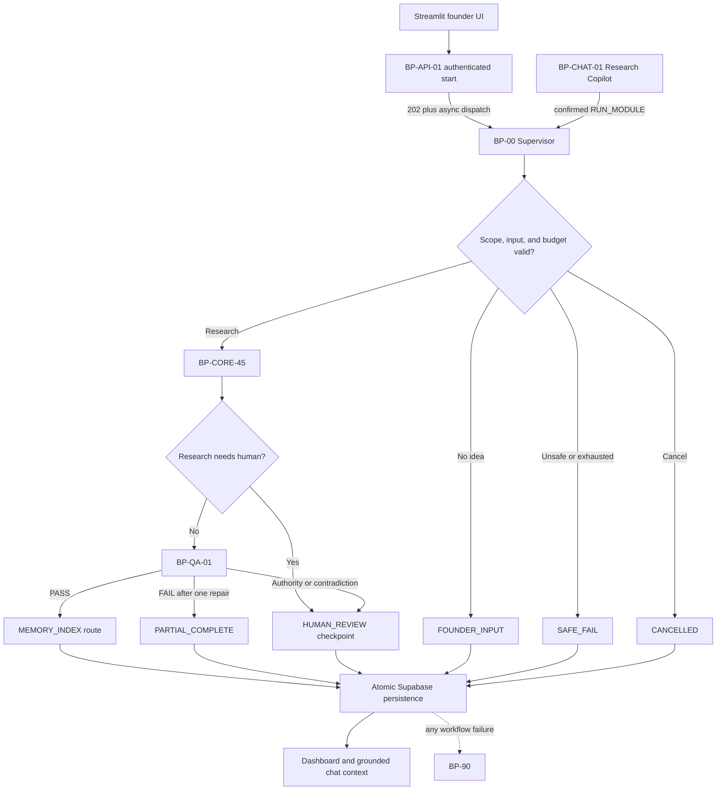

# Phase 6 — Adaptive Supervisor, Quality Gate, Chat, and Persistence

Last verified: 30 August 2026

## Outcome

Phase 6 now has a working orchestration layer rather than treating `BP-CORE-45` as the entire product. The Supervisor chooses a permitted route, calls the research specialist workflow, inspects its result, hands a candidate Blueprint to an independent critic, and returns a visible terminal or human-review outcome. A separate Research Copilot answers questions from accepted project evidence and can request a module run only after explicit confirmation.

The production database schema and atomic persistence functions are applied. The workflows are wired to use them with the founder's Supabase bearer token. The remaining acceptance test is an authenticated run from Streamlit; manual n8n fixtures intentionally skip owner persistence.

## Workflow boundaries

| Workflow | Responsibility | Current status |
|---|---|---|
| `BP-API-01 Start Run` | Validate scope, authenticate, create/replay an idempotent run, return `202`, dispatch BP-00 | Imported; authenticated Streamlit test pending |
| `BP-00 Adaptive Supervisor` | Own routing, budgets, specialist handoffs, terminal status, and persistence decision | Imported; manual live run passed |
| `BP-CORE-45 Evidence Blueprint` | Plan and execute research, deterministic finance, evidence audit, experiment design, synthesis | Imported; real provider run passed |
| `BP-QA-01 Blueprint Quality Gate` | Independently score the assembled Blueprint, allow one bounded repair, re-criticize, fail closed | Imported; PASS and safe-failure behavior verified |
| `BP-CHAT-01 Research Copilot` | Grounded Q&A, phase explanations, next-step suggestions, confirmation-gated module requests | Imported; Q&A and scope-denial tests passed |
| `BP-90 Error and Audit` | Redact, classify, record, and safely route workflow failures | Active and verified |

## Control flow

## Agentic decisions

BP-00 uses deterministic rules for hard constraints: scope denial, missing idea, cancellation, budget exhaustion, and allowed module names. BP-CORE-45 uses the normalized idea and earlier outputs to form research queries and specialist inputs. The evidence auditor can accept, limit, repair, reject, or escalate each claim. The Blueprint critic receives a seven-part rubric and can approve, request exactly one bounded revision, fail with a warning, or request human review. Chat intent is deterministically classified into question, phase explanation, next step, module run, correction, cancellation, ambiguous, or out of scope.

The system does not self-train its model. It learns safely at runtime by preserving state transitions, accepted evidence, quality results, errors, corrections, and chat history. Future routes read that audited state. Rejected evidence never becomes reusable truth.

## Bounded loops and stopping

- Supervisor transitions: maximum 20.
- Search cycles: maximum 3.
- Tool calls: maximum 80.
- Blueprint revisions: one in the final quality workflow; global state cap 3.
- Provider retry: at most two attempts on configured temporary failures.
- Every terminal branch returns `COMPLETED`, `PARTIAL`, `HUMAN_REVIEW`, `NEEDS_INPUT`, `SAFE_FAILED`, or `CANCELLED` and/or creates an audit record.

## Quality evidence from live tests

- Supervisor live run: research engine → evidence audit → synthesis → Blueprint critic → `MEMORY_INDEX`; 12 agent/supervisor trace entries; test persistence correctly skipped.
- Quality happy path: first independent verdict passed and no repair ran.
- Quality unhappy path: critic requested repair; reviser attempted unsupported material; the parser removed invented evidence IDs; final re-critic failed the incomplete Blueprint and returned `QUALITY_FAILED / PARTIAL_COMPLETE`.
- Chat Q&A: returned `NEXT_STEP`, cited only `ev-test-1`, and stated limitations.
- Chat guardrail: “Ping somebody and send them the research” returned `OUT_OF_SCOPE` with no tool or command.
- Static validation: all four Phase 6/start workflow JSON files have unique nodes, valid connection targets, syntactically valid Code nodes, allowlisted subworkflow targets, explicit error workflow, and no unapproved write URL.

## Persistence

Migrations 007 and 008 are applied and verified. They add owner-isolated run context, chat threads/messages, agent commands, expanded route/agent vocabulary, `get_supervisor_context`, `persist_supervisor_result`, and `append_chat_exchange`. RLS and 11 owner policies passed verification; anonymous access to all three RPC surfaces is blocked.

The production path writes the run result, state transition, Blueprint sections, accepted citations, final quality check, and run context atomically. Chat writes a user/assistant exchange atomically. Manual fixtures skip these writes because they have no real user JWT.

## Still required to close Phase 6

1. Connect Streamlit authentication and run one real `BP-API-01` request so the JWT-backed Supervisor/database write path is exercised.
2. Add the founder approval/correction/resume endpoint and UI controls for approve, reject, edit, request changes, more information, and cancel.
3. Bind accepted evidence to a project-isolated Pinecone namespace and verify retrieval, stale/conflicting memory handling, and deletion.
4. Add direct source-page verification for high-stakes evidence; search snippets remain directional only.

