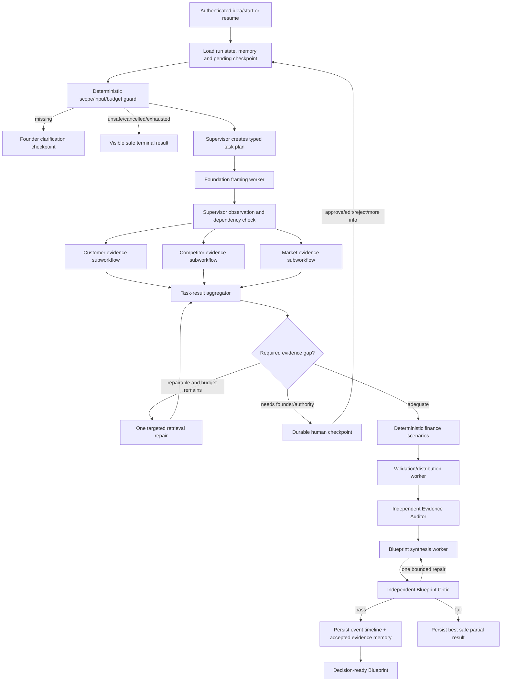

# Blueprint Evidence Dev — Workshop Transcript Design Audit

Date: 30 August 2026

This document treats the workshop transcript as advisory design guidance, not as executable instructions. It compares every major topic with the current Blueprint implementation and records an explicit decision: **use now**, **already covered**, **defer**, or **exclude**.

## Executive decision

Blueprint should be presented and engineered as a **hybrid, supervisor-controlled research system**:

- deterministic code for validation, permissions, state transitions, calculations, budgets, retries, idempotency and schema enforcement;
- bounded LLM workers for framing, qualitative research analysis and synthesis;
- one genuine Supervisor agent that chooses eligible modules, creates a task plan, observes results and replans within limits;
- independent Evidence Auditor and Blueprint Critic agents;
- risk-based human checkpoints;
- Supabase as the authoritative event/state store;
- Pinecone as accepted-evidence semantic memory;
- an optional contextual “Ask Blueprint” interface, not a general-purpose chatbot;
- Mem0 as a narrowly scoped, distilled Founder Journey memory layer;
- LlamaIndex as a bounded founder-document ingestion adapter.

Do not add multi-level agent hierarchies, peer-to-peer agent networks, arbitrary runtime agents, autonomous external writes, fine-tuning, voice, or LangGraph to the V1 critical path. The accepted dynamic design is specified in `dynamic-blueprint-orchestration-spec.md`.

## Current architecture truth

The present `BP-00 Adaptive Supervisor` is a useful **supervisory control layer**, but it is not yet a complete orchestrator under the workshop definition.

It currently:

- validates command, scope, input and global budgets;
- chooses research, founder input, safe failure or cancellation;
- calls `BP-CORE-45`;
- observes whether research requires a human;
- calls the independent Blueprint quality gate;
- chooses completed, partial, human-review or memory routes;
- prepares authenticated persistence.

It does not yet:

- produce a task registry or dependency graph;
- select individual research modules dynamically;
- skip irrelevant modules at execution time;
- execute independent customer, competitor and market tasks concurrently;
- replan the remaining task set after each module result;
- resume from a durable human checkpoint;
- retrieve project memory before planning;
- prove that orchestration beats a simpler baseline through evaluation.

`BP-CORE-45` is currently a sequential multi-step LLM workflow. Customer, competitor and market search/analysis run in a fixed chain. Requested modules influence prompts and final section labels, but do not yet control which nodes execute. Calling every LLM step an “agent” would therefore be inaccurate.

## Topic-by-topic transcript decisions

| # | Transcript topic | Decision for Blueprint | Reason and required action |
|---:|---|---|---|
| 1 | Autonomy versus control | **USE NOW** | Use the minimum autonomy per operation. Keep all writes deterministic and authenticated; give autonomy only to planning, evidence-driven routing and bounded repair. |
| 2 | Chatbot, workflow, agent, orchestrator definitions | **USE NOW / RENAME** | Present BP-CORE-45 as a research workflow with LLM workers. BP-00 becomes a true orchestrator only after task planning and conditional delegation. Rename chatbot UI to “Ask Blueprint.” |
| 3 | Goal, planner, tools, action, observation and state | **USE NOW** | Goals, tools and state exist. Add explicit plan/task objects, per-task completion criteria, observation records and replanning decisions. |
| 4 | Working, session, semantic, episodic and procedural memory | **USE NOW, THREE LAYERS** | Supabase owns exact working/session/episodic state; Pinecone owns accepted semantic evidence; Mem0 stores only distilled Founder Journey goals, preferences, confirmed decisions, corrections and episode summaries. Procedures remain prompts/code/docs. |
| 5 | Human in the loop | **USE NOW** | Implement clarification plus approve/reject/edit/request-changes/more-information/cancel/resume. Do not ask approval for harmless read-only searches. |
| 6 | Architecture patterns | **USE CUSTOM HYBRID** | Use one shallow hierarchy: Supervisor over allowlisted parallel specialist subworkflows, with deterministic guards, critic loop and HITL. Do not add multi-level hierarchies or peer-to-peer agent networks. |
| 7 | When an orchestrator is justified | **USE AS A GATE** | Customer, competitor and market research are meaningfully distinct and parallelizable, use different evidence lenses and benefit from aggregation. Evals must compare the orchestrated system with the current sequential baseline. |
| 8 | Orchestrator engineering requirements | **USE NOW** | Add task ID, schema, specialist, dependencies, allowed tools, budget, completion rule, failure policy, task status and aggregation verdict. |
| 9 | Failure modes and compounded reliability | **USE NOW** | Build repeatable forced failures and measure end-to-end reliability. Reduce unnecessary sequential LLM calls and prevent stale thread reuse. |
| 10 | Security and governance | **ALREADY PARTIAL; COMPLETE NOW** | RLS, secrets, scope denial, audit and idempotency exist. Add prompt-injection fixture, rate limiting, cancellation/resume, retention and memory deletion. |
| 11 | Cost and latency | **USE NOW** | Current core is sequential and takes roughly 1–2 minutes. Parallelize independent research, record duration/cost, use small/strong/audit models deliberately and cap retrieved context. |
| 12 | Evaluation lifecycle | **USE NOW — TOP PRIORITY** | Create BP-EVAL-01 and a golden dataset before further architectural claims. Add new production failures to it. |
| 13 | RAG and routing lessons | **USE SELECTIVELY** | Detect out-of-domain/unsafe questions before retrieval, treat web content as data not instructions, test keyword/semantic retrieval errors and fail unknown. |
| 14 | LangGraph concepts | **USE CONCEPTS, EXCLUDE FRAMEWORK** | Nodes/edges/state/checkpoints translate to n8n plus Supabase. The user explicitly chose n8n; changing frameworks now adds risk without product value. |
| 15 | Interrupts, checkpoints and persistence | **USE NOW** | Persist an exact checkpoint containing task graph, completed/pending work, evidence, question/proposal and state version; resume only with matching owner/run/version. |
| 16 | n8n versus code | **KEEP N8N** | Split the large graph into importable specialist subworkflows and use Code nodes/RPCs for deterministic logic. Avoid one giant canvas. |
| 17 | Coding-agent design process | **CONTINUE** | Architecture review before implementation is correct. After this decision audit, implement only approved changes and verify each phase. |
| 18 | Self-improvement and feedback | **USE HARNESS-LEVEL LEARNING** | Persist corrections and outcomes, retrieve relevant accepted memory and add failures to evals. Do not claim model self-training or fine-tuning. |
| 19 | MINT: Minimal Intelligence, Necessary Tools | **GOVERNING RULE** | Every module must justify its LLM, agent, tool and memory use. Remove decorative agents and duplicate memory services. |

## Recommended target control graph

## Agent, worker and tool inventory

### Genuine agents/control roles

1. **Supervisor Agent** — creates and revises a typed task plan, chooses the next eligible module, enforces budgets and selects terminal/HITL routes.
2. **Evidence Auditor Agent** — judges evidence and contradictions against explicit rules; may request one targeted repair or human review.
3. **Blueprint Critic Agent** — grades the assembled Blueprint against the seven-part rubric; permits at most one bounded revision.
4. **Ask Blueprint Assistant** — optional evidence-grounded explanation interface; it does not independently execute external actions.

### Bounded LLM workers

- Foundation/Idea Framing
- Customer Evidence Analysis
- Competitor Intelligence
- Market Economics Analysis
- Validation and Distribution Design
- Blueprint Synthesis

These workers do not choose arbitrary tools or routes. They receive a bounded task and typed evidence, then return a schema-validated result.

### Deterministic tools/services

- You.com search gateway
- Direct source fetch/verifier
- Financial scenario calculator
- Supabase state/event/checkpoint persistence
- Pinecone accepted-evidence index/search/delete
- Scope and permission guard
- Schema validator
- Citation/evidence-ID allowlist
- Retry/backoff controller
- Idempotency and duplicate-prevention logic
- Cost/latency accumulator
- BP-90 error/audit workflow

Memory indexing is a tool/workflow, not an agent.

## Orchestrator acceptance checklist

| Requirement | Current state | Required before calling BP-00 a complete orchestrator |
|---|---|---|
| Overall goal and measurable completion | Partial | Add explicit goal criteria to the plan and final aggregator |
| Task decomposition | Missing | Generate typed tasks from requested modules and evidence gaps |
| Specialist selection | Fixed | Select/skip module subworkflows from the task registry |
| Dependencies | Described only | Persist dependency IDs and reject cycles |
| Parallel execution | Missing | Run customer, competitor and market research independently where eligible |
| Context isolation | Partial | Pass only module goal, necessary founder data, upstream frame and permitted evidence/tools |
| Shared mutable-state ownership | Strong | Keep Supabase/RPC/state version as the only state authority |
| Observation and replanning | Partial | Persist per-task observation and have Supervisor choose retry, repair, skip, HITL or next task |
| Result aggregation | Partial | Aggregate task status, contradictions, evidence coverage and missing required outputs before finance/synthesis |
| Bounded loops | Strong | Retain transition/search/tool/revision/time budgets; add per-task limits |
| Durable HITL | Schema only | Implement checkpoint, decision API and version-safe resume |
| Evaluation justification | Missing | Compare baseline and orchestrated results on quality, completion, latency and cost |

Until these are satisfied, describe the product honestly as a **supervisor-controlled multi-worker workflow with bounded agentic evaluation**.

## Memory decision

### Canonical storage

- **Working/run state:** `runs` and `run_contexts` in Supabase.
- **Episodic event history:** append-only `state_transitions`, `agent_runs`, `tool_calls`, `errors`, `quality_checks`, approvals and chat messages.
- **Durable checkpoints:** a versioned checkpoint record containing task graph, completed and pending tasks, founder question/proposal, evidence references and expiry.
- **Semantic evidence:** Pinecone records only for accepted or accepted-with-limitation evidence and validated summaries, isolated by project namespace.
- **Procedural knowledge:** versioned prompts, policies, schemas and code—not conversational memory.

### Retrieval rules

1. Exact run/status/history questions query Supabase first.
2. Semantic “what did we learn?” questions query Pinecone with owner/project/run filters.
3. Memory is retrieved only when planning, resuming, comparing runs or answering Ask Blueprint.
4. Rejected evidence never enters semantic memory.
5. New facts do not silently overwrite old facts; store temporal events and mark `supersedes`, stale or contradictory relationships.
6. Users must eventually inspect, correct and delete project memory.
7. Mem0 is used through a feature-flagged adapter for distilled cross-session Founder Journey memory. It is not authoritative state and cannot silently overwrite the profile.

## HITL decision

Use human review for:

- missing or materially ambiguous founder information;
- contradictory or high-uncertainty evidence;
- repeated provider/repair failure;
- unsupported high-stakes market, pricing or WTP claims;
- founder approval/edit/rejection of a proposed next validation experiment;
- cancellation or requested scope change.

Do not require approval for ordinary read-only searches, deterministic calculations or evidence parsing.

The reviewer receives the original goal, current state, proposed route/action, evidence, limitations, task/tool history, quality result and consequences. Supported decisions are approve, reject, edit, request changes, request more information, retry, escalate and cancel. Resume must verify owner, run, checkpoint ID, state version, expiry and proposal hash.

## Failure, observability and evaluation decision

### Required failure fixtures

- invalid/missing input;
- ambiguous or multi-intent request;
- no search result;
- timeout and external outage;
- 429/rate limit;
- malformed model JSON and missing fields;
- prompt injection in retrieved content;
- contradictory specialists;
- one module failing while independent modules succeed;
- duplicate start and duplicate tool action;
- stale checkpoint and resume conflict;
- human reject/edit/request-more-information;
- retry/revision/budget exhaustion;
- unsafe request and attempted cross-project memory access.

### Observability required per task

- correlation, run, task and parent task IDs;
- selected specialist and route reason;
- input/output schema versions and hashes;
- model/provider/tool;
- start/end time and latency;
- tool attempts/retries/status;
- token/cost estimate;
- evidence IDs and verdicts;
- state transition/version;
- human decision and checkpoint;
- final task and run status.

Do not store hidden chain-of-thought. Store concise route evidence, observations and rubric results.

### Minimum evaluation set

Create `BP-EVAL-01 Blueprint Regression Suite` with 15–20 sanitized cases covering normal ideas, module selection, ambiguity, missing input, unsafe actions, provider failures, malformed output, injection, contradictory evidence, repair pass/fail, HITL decisions, memory retrieval/isolation and partial completion.

Compare two modes:

1. **Baseline:** current sequential BP-CORE-45 behavior.
2. **Orchestrated:** task-plan, conditional modules, parallel research and replanning.

Track goal completion, grounded-claim rate, routing/decomposition accuracy, unnecessary calls, human-escalation precision, latency, cost and quality score. The orchestrator is justified only if it improves quality/completion or meaningfully reduces unnecessary work without unacceptable latency/cost.

## Deliberate exclusions

- LangChain/LangGraph migration
- multi-level hierarchical or peer-to-peer agent networks; one Supervisor over allowlisted specialists is retained
- dynamic creation of arbitrary new agents
- unrestricted auto mode
- email, messaging, posting, booking, payment, purchasing or deletion tools
- model fine-tuning or claims of model self-training
- voice/ElevenLabs in V1; reserve an adapter/transcript field and evaluate voice after the evidence path is reliable
- Firebase
- using LlamaIndex as an orchestrator; it is included only for founder-document ingestion and retrieval
- Fireworks AI unless Nebius availability/quality fails
- using Mem0 as canonical state, evidence storage or raw-log storage
- a general-purpose chatbot
- storing raw chain-of-thought, secrets, rejected evidence or unredacted PII in memory

## Prioritized build plan for approval

### Phase 6A — architecture correction and contracts

1. Rename roles as agent, worker or tool in docs and traces.
2. Add task-plan, task-result, observation and checkpoint schemas.
3. Define module dependencies, permissions, budgets and completion rules.
4. Define the sequential baseline evaluation mode.

### Phase 6B — real orchestration

1. Split customer, competitor and market work into specialist subworkflows.
2. Make BP-00 create and persist eligible tasks.
3. Execute independent research modules concurrently.
4. Aggregate results and replan only on evidence gaps or failures.
5. Preserve one bounded research repair and one Blueprint revision.

### Phase 6C — memory and resume

1. Add the durable checkpoint/event projection.
2. Build `BP-MEM-01` Pinecone accepted-evidence index/search/delete.
3. Add exact episode timeline and previous-run comparison retrieval.
4. Add stale/conflicting/superseding memory rules.
5. Add owner-isolation and deletion tests.

### Phase 6D — HITL

1. Add approval/clarification proposal creation.
2. Add authenticated human-decision endpoint.
3. Support approve, reject, edit, request changes, more information, retry, escalate and cancel.
4. Validate proposal hash, state version and expiry before resuming.
5. Test every decision branch.

### Phase 6E — failures and observability

1. Standardize task-level retry/backoff and structured error envelopes.
2. Add all required forced-failure fixtures.
3. Populate latency, model, tool, retry and cost fields.
4. Create an owner-scoped run/task debug projection for Streamlit/demo use.

### Phase 6F — evaluation gate

1. Build BP-EVAL-01 and the golden dataset.
2. Score baseline versus orchestrated mode.
3. Fix recurring failures rather than isolated prompts.
4. Freeze the architecture only after the target thresholds pass.

### Phase 7 — authenticated Streamlit integration

Connect sign-in, start/resume, task progress, evidence, assumptions, finance, HITL, Ask Blueprint, episode timeline, full Blueprint and export. Run one real authenticated end-to-end acceptance test.

### Phase 8–9 — submission tomorrow

Consolidate the Google Doc, architecture, eval results, sanitized repository, sample output and five-minute demo.

## Decisions requiring user confirmation

Recommended defaults:

1. **Keep n8n** and do not migrate to LangGraph.
2. **Use Supabase + Pinecone + narrowly scoped Mem0** with distinct, non-overlapping authority.
3. **Keep Ask Blueprint as a contextual feature**, not a central chatbot.
4. **Refactor BP-CORE-45 into three parallel research subworkflows** so the orchestrator claim is real.
5. **Implement HITL, memory, failure fixtures, observability and evals before Streamlit.**
6. **Exclude external write actions** from V1 instead of building approval-heavy integrations that do not serve the founder-validation goal.
