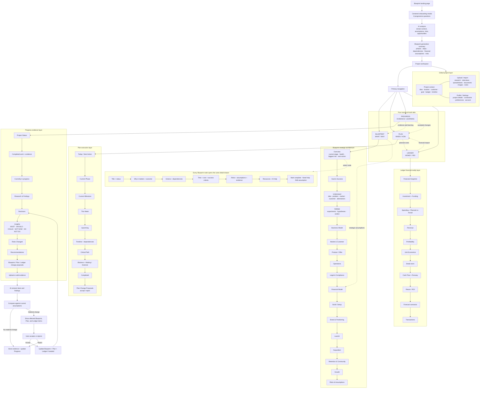
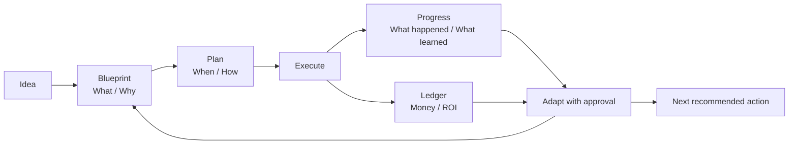

# Blueprint — Information Architecture

```mermaid
flowchart TB
    HOME["Blueprint landing page"] --> ONBOARD["Centered onboarding modal\n8 progressive questions"]
    ONBOARD --> ANALYSIS["AI analysis\nextract context, assumptions, risks, opportunities"]
    ANALYSIS --> SUMMARY["Blueprint generation summary\nphases · steps · dependencies · financial assumptions · risks"]
    SUMMARY --> WORKSPACE["Project workspace"]

    subgraph GLOBAL["Global project layer"]
      PROJECT["Project context\nidea · location · customer · goal · budget · timeline"]
      UPLOAD["Upload / Import\nresearch · interviews · spreadsheets · documents · images · notes"]
      SETTINGS["Profile / Settings\nproject details · constraints · preferences · account"]
      PROJECT --- UPLOAD
      PROJECT --- SETTINGS
    end

    WORKSPACE --> GLOBAL
    WORKSPACE --> NAV["Primary navigation"]

    subgraph TABS["Four source-of-truth tabs"]
      BLUEPRINT["BLUEPRINT\nWHAT / WHY"]
      PLAN["PLAN\nWHEN / HOW"]
      PROGRESS["PROGRESS\nEVIDENCE / LEARNING"]
      LEDGER["LEDGER\nMONEY / ROI"]
    end
    NAV --> BLUEPRINT
    NAV --> PLAN
    NAV --> PROGRESS
    NAV --> LEDGER

    subgraph B["Blueprint strategic architecture"]
      BOV["Overview\ncurrent stage · health · biggest risk · next action"]
      GOAL["Goal & Success"]
      UNDER["Understand\nidea · problem · market · customer · alternatives"]
      VALIDATE["Validate\nexperiments · hypotheses · verdict"]
      MODEL["Business Model"]
      MARKET["Market & Customer"]
      OFFER["Product / Offer"]
      OPS["Operations"]
      LEGAL["Legal & Compliance"]
      FINMODEL["Financial Model"]
      SETUP["Build / Setup"]
      BRAND["Brand & Positioning"]
      LAUNCH["Launch"]
      ACQUIRE["Acquisition"]
      RETAIN["Retention & Community"]
      GROW["Growth"]
      RISKS["Risks & Assumptions"]
      BOV --> GOAL --> UNDER --> VALIDATE --> MODEL --> MARKET --> OFFER --> OPS --> LEGAL --> FINMODEL --> SETUP --> BRAND --> LAUNCH --> ACQUIRE --> RETAIN --> GROW --> RISKS
    end
    BLUEPRINT --> BOV

    subgraph NODE["Every Blueprint node opens the same detail drawer"]
      N1["Title + status"] --> N2["Why it matters + outcome"]
      N2 --> N3["Actions + dependencies"]
      N3 --> N4["Time + cost + success criteria"]
      N4 --> N5["Risks + assumptions + evidence"]
      N5 --> N6["Resources + AI help"]
      N6 --> N7["Mark complete · Need help · Edit assumption"]
    end
    BOV -. "select node" .-> NODE

    subgraph P["Plan execution layer"]
      TODAY["Today / Next Action"]
      PHASE["Current Phase"]
      MILESTONE["Current Milestone"]
      WEEK["This Week"]
      UPCOMING["Upcoming"]
      TIMELINE["Timeline + dependencies"]
      CRITICAL["Critical Path"]
      BLOCKERS["Blockers + Waiting / External"]
      DONE["Completed"]
      CHANGES["Plan Change Proposals\naccept / reject"]
      TODAY --> PHASE --> MILESTONE --> WEEK --> UPCOMING --> TIMELINE --> CRITICAL --> BLOCKERS --> DONE --> CHANGES
    end
    PLAN --> TODAY

    subgraph PR["Progress evidence layer"]
      STATUS["Project Status"]
      COMPLETED["Completed work + evidence"]
      ACTIVE["Currently in progress"]
      FINDINGS["Research & Findings"]
      DECISIONS["Decisions"]
      INSIGHTS["Insights\nMUST · SHOULD · COULD · NOT NOW · DO NOT DO"]
      RISKCHANGE["Risks Changed"]
      RECS["Recommendations"]
      PROPOSALS["Blueprint / Plan / Ledger change proposals"]
      ADD["Upload or add evidence"]
      STATUS --> COMPLETED --> ACTIVE --> FINDINGS --> DECISIONS --> INSIGHTS --> RISKCHANGE --> RECS --> PROPOSALS --> ADD
    end
    PROGRESS --> STATUS

    subgraph L["Ledger financial reality layer"]
      SNAP["Financial Snapshot"]
      INVEST["Investment + Funding"]
      SPEND["Spending + Planned vs Actual"]
      REVENUE["Revenue"]
      PROFIT["Profitability"]
      UNIT["Unit Economics"]
      BREAK["Break-even"]
      CASH["Cash Flow + Runway"]
      ROI["Return / ROI"]
      FORECAST["Forecast scenarios"]
      TXNS["Transactions"]
      SNAP --> INVEST --> SPEND --> REVENUE --> PROFIT --> UNIT --> BREAK --> CASH --> ROI --> FORECAST --> TXNS
    end
    LEDGER --> SNAP

    ADD --> EXTRACT["AI extracts facts and findings"]
    EXTRACT --> COMPARE["Compare against current assumptions"]
    COMPARE -->|"No material change"| STORE["Store evidence + update Progress"]
    COMPARE -->|"Material change"| PROPOSE["Show affected Blueprint, Plan, and Ledger items"]
    PROPOSE --> APPROVE["User accepts or rejects"]
    APPROVE -->|"Accept"| UPDATE["Update Blueprint + Plan + Ledger if needed"]
    APPROVE -->|"Reject"| STORE
    UPDATE --> DECISIONS

    BLUEPRINT -. "strategic assumptions" .-> FINMODEL
    PLAN -. "planned costs" .-> LEDGER
    PROGRESS -. "evidence and learning" .-> BLUEPRINT
    LEDGER -. "financial impact" .-> PLAN
    PROGRESS -. "accepted changes" .-> PLAN
```

## Core loop

```mermaid
flowchart LR
  IDEA["Idea"] --> BLUEPRINT["Blueprint\nWhat / Why"]
  BLUEPRINT --> PLAN["Plan\nWhen / How"]
  PLAN --> EXECUTE["Execute"]
  EXECUTE --> PROGRESS["Progress\nWhat happened / What learned"]
  PROGRESS --> ADAPT["Adapt with approval"]
  ADAPT --> BLUEPRINT
  EXECUTE --> LEDGER["Ledger\nMoney / ROI"]
  LEDGER --> ADAPT
  ADAPT --> NEXT["Next recommended action"]
```
